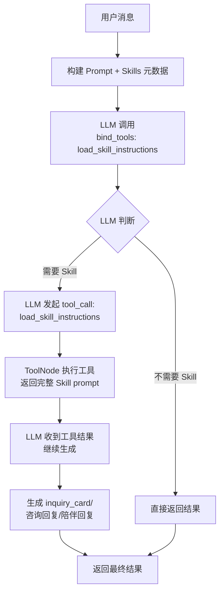
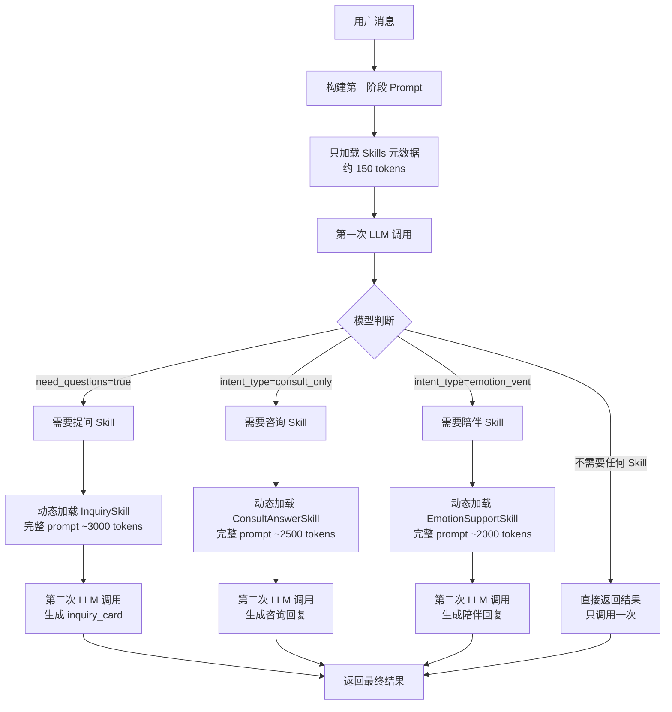
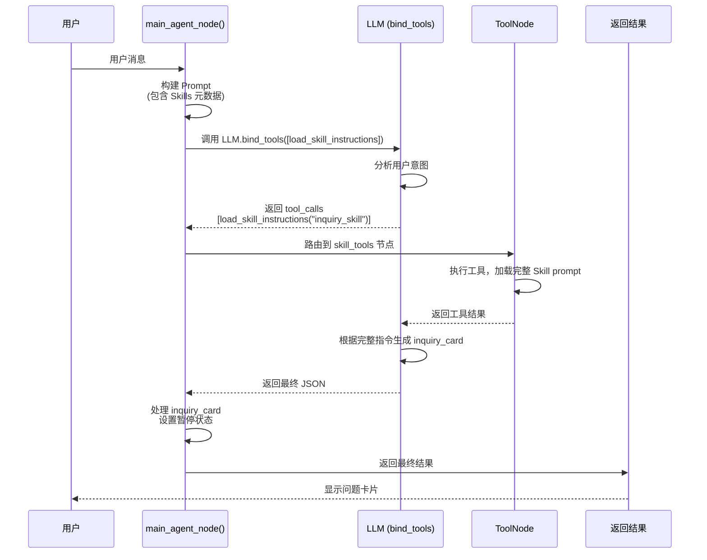

# Skill 渐进式披露机制演示

本文档展示 Anthropic 风格的渐进式 Skill 加载机制在实际运行中的完整流程。

> **v1.4 更新**：从「两阶段 API 调用」升级为「LangChain Tool-Use 单次调用闭环」

## 流程图（v1.4 Tool-Use 版本）



**关键变化**：
- ❌ 旧方案：工程代码判断 → 两次 LLM 调用
- ✅ 新方案：LLM 自主 tool_call → 单次调用闭环

---

## 旧方案流程图（v1.3 两阶段调用，已废弃）

<details>
<summary>点击展开旧方案</summary>



</details>

## 场景设定

**用户消息**："我最近有点头疼，不知道该怎么办"

**预期行为**：主 Agent 判断需要提问，通过 tool_call 加载完整 Skill 指令

---

## v1.4 Tool-Use 执行流程

### 工程代码执行流程（单次调用闭环）

```python
from skills.tool import load_skill_instructions

# 1. 绑定工具
llm = get_llm().bind_tools([load_skill_instructions])

# 2. 构建 Prompt（只包含元数据）
prompt = main_agent_template.format(
    user_message="我最近有点头疼，不知道该怎么办",
    user_context="...",
    status_report="暂无",
    action_plan="暂无",
    action_guides="暂无",
    conversation_history="无历史对话",
    skills_prompt=_get_skills_metadata_prompt(),  # 只包含元数据
)

# 3. 调用 LLM（可能产生 tool_calls）
response = llm.invoke(prompt)

# 4. 如果有 tool_calls，LangGraph ToolNode 自动执行
if response.tool_calls:
    # tool_calls = [{"name": "load_skill_instructions", "args": {"skill_id": "inquiry_skill"}}]
    # ToolNode 执行后返回完整 Skill prompt
    # LLM 继续生成最终结果（包含 inquiry_card）
    pass

# 5. 最终结果
result = _parse_response(response.content, state)
# result = {
#     "intent_type": "action_trigger",
#     "need_questions": true,
#     "response": "我理解你的困扰，让我帮你分析一下～",
#     "next_action": "ask_user",
#     "inquiry_card": {...},  # ← 已包含完整问题卡片
# }
```

---

## 旧方案：两阶段调用（v1.3，已废弃）

<details>
<summary>点击展开旧方案代码</summary>

```python
# 1. 构建 Prompt（只包含元数据）
prompt = main_agent_template.format(
    user_message="我最近有点头疼，不知道该怎么办",
    user_context="...",
    status_report="暂无",
    action_plan="暂无",
    action_guides="暂无",
    conversation_history="无历史对话",
    # 关键：只加载元数据
    skills_prompt=_get_skills_metadata_prompt(),  # ← 只包含元数据
)

# 2. 第一次 LLM 调用
response = llm.invoke(prompt)

# 3. 解析输出
result = _parse_response(response.content, state)
# result = {
#     "intent_type": "action_trigger",
#     "need_questions": true,  # ← 模型判断需要提问
#     "response": "我理解你的困扰，让我帮你分析一下～",
#     "next_action": "ask_user",
#     "inquiry_card": null,  # ← 第一阶段还没有生成
# }
```

</details>

### v1.4 完整 Prompt（实际示例）

**注意**：这是实际运行时的 prompt，包含 Skills 元数据 + 工具调用说明。

```
# 主 Agent Prompt

你是**小话**，一个专业的 AI 恋爱军师。你的使命是帮助用户解决与 Crush 相处过程中的情感推进问题。

## 当前对话上下文

### 用户最新消息
我最近有点头疼，不知道该怎么办

### 用户和 Crush 的所有信息
暂无用户信息

### 现状分析报告
暂无

### 行动规划
暂无

### 行动指南
暂无

### 对话历史
无历史对话

---

## 📚 可用技能

以下是可用技能的简要描述。当你判断需要使用某个技能时，请调用 `load_skill_instructions` 工具获取完整执行指令。

- **inquiry_skill**：生成结构化的引导性问题，帮助收集用户信息
- **consult_answer_skill**：针对用户的情感问题提供专业分析和解答
- **emotion_support_skill**：提供情感支持和陪伴，帮助用户缓解情绪

**使用方法**：调用 `load_skill_instructions(skill_id)` 获取完整指令后再执行。

---

## 你的任务

### 1. 理解用户意图
判断用户消息的意图类型：
- `consult_only`: 纯咨询，想问问题
- `emotion_vent`: 情绪发泄，需要安慰
- `action_trigger`: 需要触发具体行动（分析/规划/指南）
- `info_update`: 提供了新的信息

### 2. 回应用户
根据对话历史，给出**连贯、不重复、有进展感**的回复

### 3. 决策下一步
根据看板状态和用户意图，决定：
- `ask_user`: 信息不足，需要向用户提问（先调用 load_skill_instructions("inquiry_skill")）
- `call_status`: 需要生成或更新现状分析
- `call_plan`: 需要生成或更新行动规划
- `call_guide`: 需要生成或更新行动指南
- `end_turn`: 本轮对话结束，等待用户下一条消息

## 输出格式

请严格以 JSON 格式输出：
```json
{
  "response": "给用户的回复（自然、温暖、简短、接着对话历史往下说）",
  "intent_type": "consult_only|emotion_vent|action_trigger|info_update",
  "next_action": "ask_user|call_status|call_plan|call_guide|end_turn",
  "need_questions": false,
  "inquiry_card": null,
  "mark_guide_completed": false,
  "completed_guide_id": null
}
```
```

### LLM 行为（Tool-Use 闭环）

**Step 1: LLM 分析后决定调用工具**

```json
{
  "tool_calls": [
    {
      "name": "load_skill_instructions",
      "args": {"skill_id": "inquiry_skill"}
    }
  ]
}
```

**Step 2: ToolNode 执行，返回完整 Skill prompt**

```
# 提问 Skill

你是恋爱军师「小话」的提问能力模块...
[完整的 inquiry_skill.md 内容]
```

**Step 3: LLM 收到工具结果，生成最终输出**

```json
{
  "response": "我理解你的困扰，让我帮你分析一下～",
  "intent_type": "action_trigger",
  "next_action": "ask_user",
  "need_questions": true,
  "inquiry_card": {
    "questions": [...],
    "intro": "...",
    "reasoning": "..."
  },
  "mark_guide_completed": false,
  "completed_guide_id": null
}
```

**关键优势**：
- ✅ 单次 API 调用闭环（LLM 内部处理工具调用）
- ✅ LLM 自主决定是否需要工具（不是工程代码 if/else）
- ✅ 代码大幅简化

## `load_skill_instructions` 工具定义

```python
# skills/tool.py
from langchain.tools import tool
from utils.prompt_loader import load_prompt

@tool
def load_skill_instructions(skill_id: str):
    """
    当识别到用户需要咨询、提问或陪伴时，调用此工具获取该技能的详细执行指令。
    参数 skill_id 必须是: inquiry_skill, consult_answer_skill, emotion_support_skill 之一。
    """
    return load_prompt(skill_id)
```

---

## LangGraph 工作流集成

```python
from langgraph.graph import StateGraph, END
from langgraph.prebuilt import ToolNode
from skills.tool import load_skill_instructions

def create_workflow():
    workflow = StateGraph(AgentState)
    
    # 添加节点
    workflow.add_node("router", router_node)
    workflow.add_node("main_agent", main_agent_node)
    workflow.add_node("status_agent", status_agent_node)
    workflow.add_node("plan_agent", plan_agent_node)
    workflow.add_node("guide_agent", guide_agent_node)
    workflow.add_node("wait_user_input", wait_user_input_node)
    workflow.add_node("skill_tools", ToolNode([load_skill_instructions]))  # Tool-Use 节点
    
    # 路由逻辑
    def route_after_agent(state):
        messages = state.get("messages", [])
        if messages and hasattr(messages[-1], "tool_calls") and messages[-1].tool_calls:
            return "skill_tools"
        if state.get("current_agent") and state.get("agent_resume_point"):
            return "wait_user_input"
        return "main_agent"
    
    # 连接边
    workflow.add_conditional_edges("main_agent", route_after_agent, {...})
    workflow.add_edge("skill_tools", "main_agent")
    
    return workflow
```

---

## v1.4 工程代码完整处理流程

### 代码执行流程图



### 代码执行顺序（v1.4 简化版）

```python
from skills.tool import load_skill_instructions

def main_agent_node(state: AgentState) -> dict[str, Any]:
    # 绑定工具
    llm = get_llm(temperature=0.7).bind_tools([load_skill_instructions])
    
    # 构建 Prompt（只包含元数据 + 工具使用说明）
    format_kwargs = {
        "user_message": state.get("user_message", ""),
        "user_context": context_dict.get("user_context", "暂无用户信息"),
        "status_report": context_dict.get("status_report", "暂无"),
        "action_plan": context_dict.get("action_plan", "暂无"),
        "action_guides": context_dict.get("action_guides", "暂无"),
        "conversation_history": context_dict.get("conversation_history", "无历史对话"),
        "skills_prompt": _get_skills_metadata_prompt(),  # 只包含元数据
    }
    
    prompt = prompt_template.format(**format_kwargs)
    
    # 单次 LLM 调用（LLM 自主决定是否调用工具）
    response = llm.invoke(prompt)
    
    # 如果有 tool_calls，返回状态让 ToolNode 处理
    if response.tool_calls:
        return {
            **state,
            "messages": state.get("messages", []) + [response],
        }
    
    # 解析最终结果（已包含 inquiry_card）
    result = _parse_response(response.content, state)
    
    # 检查是否有完整的 inquiry_card
    inquiry_card = result.get("inquiry_card")
    if inquiry_card and inquiry_card.get("questions"):
        result["next_action"] = "ask_user"
        result["current_agent"] = "main_agent"
        result["agent_resume_point"] = "continue_decision"
    
    return result
```

**关键简化**：
1. ❌ 移除两阶段调用逻辑
2. ❌ 移除 `_get_skill_full_prompt_by_type()` 函数
3. ✅ 使用 `bind_tools()` 让 LLM 自主决定
4. ✅ ToolNode 自动处理工具调用

---

## 方案演进对比

### 核心差异

| 维度 | v1.2（一次性加载） | v1.3（两阶段调用） | v1.4（Tool-Use） |
|------|---------------------|---------------------|---------------------|
| **Skill 加载方式** | 所有完整 prompt | 元数据 → 按需加载 | LLM 自主 tool_call |
| **LLM 调用次数** | 1 次 | 1-2 次 | 1 次（内部闭环） |
| **Token 消耗** | ~9500 | ~2150-5150 | ~2150 + 工具返回 |
| **决策者** | 无（全加载） | 工程代码 if/else | LLM 自主决定 |
| **代码复杂度** | 简单 | 高（两阶段逻辑） | 低（ToolNode 封装） |
| **符合 Claude 理念** | ❌ | 部分 ✅ | 完全 ✅ |

### Token 使用对比

#### v1.2（一次性加载所有 Skills）

```
主 Prompt: ~2000 tokens
+ InquirySkill 完整 prompt: ~3000 tokens
+ ConsultAnswerSkill 完整 prompt: ~2500 tokens
+ EmotionSupportSkill 完整 prompt: ~2000 tokens
─────────────────────────────────────────
总计: ~9500 tokens（每次调用都加载）
```

#### v1.3（两阶段调用）

**场景1：需要提问**
```
第一阶段 Prompt: ~2000 + 150 = ~2150 tokens
第二阶段 Prompt: ~2150 + 3000 = ~5150 tokens
─────────────────────────────────────────
总消耗: ~5150 tokens（节省 ~4350 tokens）
```

#### v1.4（Tool-Use，当前方案）

**场景1：需要提问**
```
初始 Prompt: ~2000 + 150 = ~2150 tokens
+ 工具返回: ~3000 tokens（只在需要时）
─────────────────────────────────────────
总消耗: ~5150 tokens（与 v1.3 相当）
但：代码更简洁，LLM 自主决策更灵活
```

**场景2：不需要任何 Skill**
```
初始 Prompt: ~2150 tokens
─────────────────────────────────────────
总计: ~2150 tokens（无额外消耗）
```

---

## v1.4 关键优势

1. **单次 API 闭环**：LLM 内部完成「判断 → 调用工具 → 执行」
2. **LLM 自主决策**：不依赖工程代码 if/else，更灵活
3. **代码大幅简化**：移除两阶段逻辑，ToolNode 自动处理
4. **符合 Claude 理念**：真正的渐进式披露，按需加载
5. **Token 经济性**：不需要的 Skill 不占用上下文空间

---

## 关键文件清单（v1.4）

1. **`agent_impl/skills/tool.py`**（新增）
   - 定义 `load_skill_instructions` 工具
   - 使用 `@tool` 装饰器

2. **`agent_impl/skills/__init__.py`**
   - 导出 `load_skill_instructions`

3. **`agent_impl/graph/workflow.py`**
   - 添加 `skill_tools` ToolNode
   - 添加工具调用路由逻辑

4. **`agent_impl/graph/nodes/main_agent.py`**
   - 使用 `bind_tools()` 绑定工具
   - 移除两阶段调用逻辑
   - 移除 `_get_skill_full_prompt_by_type()`

5. **`agent_impl/graph/nodes/status_agent.py`**
   - 使用 `bind_tools()` 绑定工具
   - 移除两阶段调用逻辑

6. **`agent_impl/graph/nodes/plan_agent.py`**
   - 使用 `bind_tools()` 绑定工具
   - 移除两阶段调用逻辑

7. **`agent_impl/graph/nodes/guide_agent.py`**
   - 使用 `bind_tools()` 绑定工具
   - 移除两阶段调用逻辑


