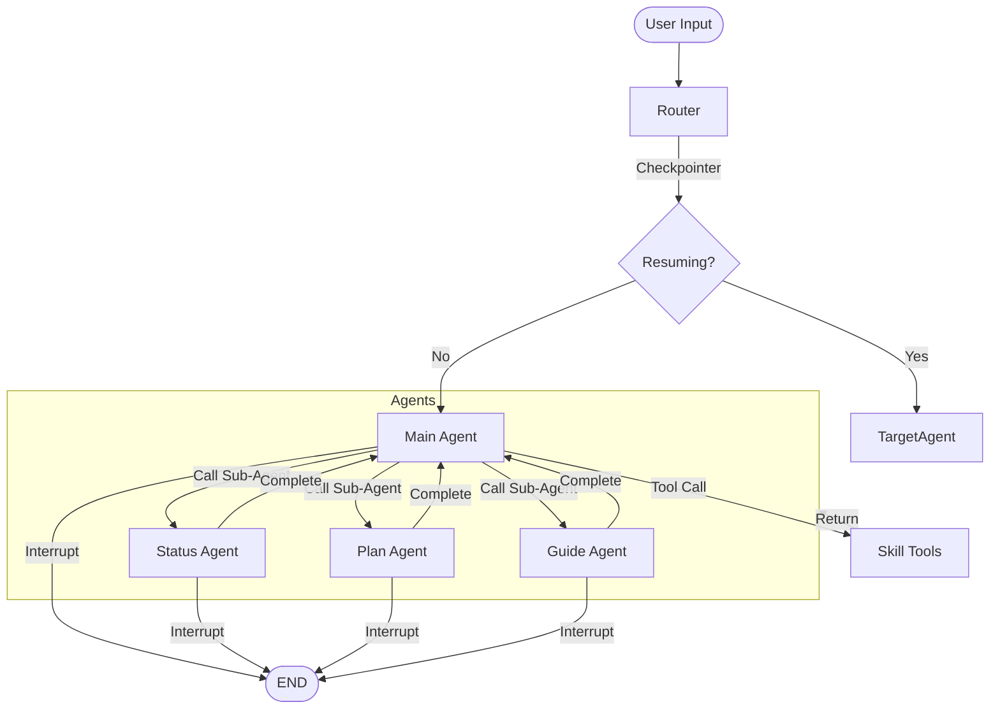

# Crushe AI Agent 实现

基于 LangGraph 的 AI 恋爱军师 Agent 架构实现。

> **v2.1 更新 (Architecture Upgrade)**：
> - **Human-in-the-Loop**：升级为 LangGraph 原生 `interrupt()` 机制
> - **Persistence**：集成 Checkpointer，支持跨会话记忆
> - **State**：优化状态结构，增加统一循环控制

## 目录结构

```
agent_impl/
├── main.py                    # 入口文件，提供交互式对话
├── config.py                  # LLM 配置（支持 DeepSeek/OpenAI/Claude）
├── requirements.txt           # 依赖包
├── env.example                # 环境变量示例
│
├── graph/
│   ├── state.py              # AgentState 状态定义 (v2.1 Updated)
│   ├── workflow.py           # LangGraph 工作流编排 (v2.1 Updated)
│   └── nodes/
│       ├── router.py         # 前置路由节点
│       ├── main_agent.py     # 主 Agent 节点
│       ├── status_agent.py   # 现状分析 Agent 节点
│       ├── plan_agent.py     # 行动规划 Agent 节点
│       └── guide_agent.py    # 行动指南 Agent 节点
│
├── skills/
│   ├── __init__.py           # Skills 模块导出
│   ├── base.py               # Skill 基类
│   ├── tool.py               # load_skill 工具定义
│   └── ...
│
├── prompts/                   # Prompt 独立维护
│   └── ...
```

## 快速开始

### 1. 安装依赖

```bash
cd agent_impl
pip install -r requirements.txt
```

### 2. 配置环境变量

```bash
# 复制示例配置
cp env.example .env
# 编辑 .env 文件，填入 API Key
```

### 3. 运行

```bash
python main.py
```

## 架构说明

> 详细架构设计请参考 [docs/architecture.md](docs/architecture.md)

### 核心工作流 (v2.1)



### Human-in-the-Loop (Interrupt)

系统使用 LangGraph 的 `interrupt` 机制处理人机交互：

1.  **暂停**：当 Agent 需要提问时，调用 `interrupt()`，工作流暂停并在 Checkpointer 中保存状态。
2.  **等待**：系统将控制权交还给用户。
3.  **恢复**：用户回复后，工作流从暂停点恢复执行。

### Skill 加载 (Tool-Use)

Skills 通过 LLM 原生工具调用加载：

1.  Prompt 只包含 Skills 元数据。
2.  LLM 判断需要 Skill 时，发起 `load_skill` 工具调用。
3.  `skill_tools` 节点执行工具，返回完整指令。
4.  LLM 根据指令生成最终结果。

## 调试

设置环境变量 `DEBUG=1` 可以看到详细错误信息：

```bash
DEBUG=1 python main.py
```

## 相关文档

-   [详细架构设计 (v2.1)](docs/architecture.md)
-   [上下文工程策略](docs/context_engineering.md)
-   [Skill 渐进式披露机制](docs/skill_demo.md)
-   [调试指南](docs/debug_guide.md)
-   [快速开始 (详细版)](docs/quick_start.md)
