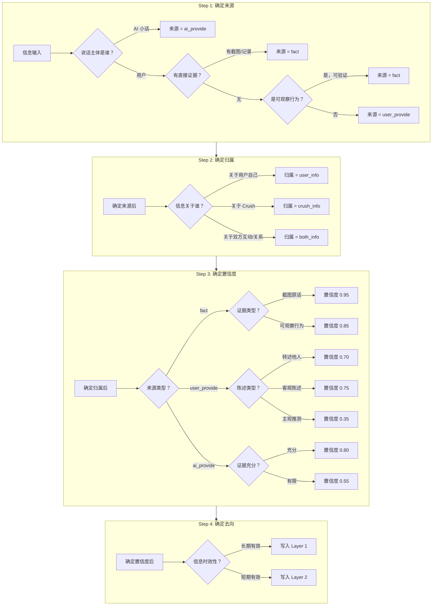

# 来源判断规则规范 v1.0

> **文档状态**：Draft v1.0  
> **最后更新**：2026-01-19  
> **适用范围**：Organize Agent 信息分类  
> **文档目的**：明确定义来源维度的判断边界，解决模糊场景的归属问题

---

## 1. 核心规则回顾（精简版）

### 1.1 三种来源定义

| 来源 | 定义 | 信任度 |
|:----|:----|:------|
| **user_provide** | 用户直接陈述的信息，说话主体是用户本人。包括用户的自述、描述、转述和判断。 | 🥉 最低 |
| **fact** | 有直接证据支撑的信息。主要来源是聊天截图、可观察的客观行为数据。 | 🥇 最高 |
| **ai_provide** | AI（小话）基于证据分析得出的结论。说话主体是 AI。 | 🥈 中等 |

### 1.2 关键判断原则

```
判断来源的核心问题是：「这条信息的原始出处是谁？」

- 用户的嘴 → user_provide（即使内容是关于 Crush 的）
- Crush 的嘴（通过截图） → fact
- AI 的分析 → ai_provide
```

---

## 2. 边界情况处理（重点）

### 2.1 边界情况对照表

| 场景 | 来源归属 | 置信度 | 归属维度 | 书写规范 | 理由 |
|:----|:--------|:------|:--------|:--------|:----|
| **用户转述 Crush 的话**<br>如"她跟我说她有男朋友" | `user_provide` | 0.7 | crush_info | "用户转述：Crush 表示自己有男朋友" | 虽然内容可信度较高，但信息经过用户这一层「传递」，可能存在理解偏差或记忆误差。**来源是用户的转述，不是直接证据** |
| **用户的主观推测**<br>如"我感觉她喜欢我" | `user_provide` | 0.3 | crush_info / both_info | "用户感觉：Crush 对自己有好感" | 这是用户的主观判断，没有客观依据。用户容易美化或误读对方态度，信任度最低 |
| **用户描述 Crush 的行为**<br>如"她已读不回 3 天了" | `fact` | 0.85 | both_info | "用户反馈：Crush 已读不回 3 天" | 这是可观察的客观行为，虽然没有截图佐证，但行为本身是事实。用户难以编造这类具体行为 |
| **AI 引用聊天截图做分析** | `ai_provide`（结论）<br>`fact`（引用的证据） | 0.75-0.85 | 视内容 | "AI 分析：基于聊天记录，Crush 态度偏冷淡" | 需要拆分处理：截图中的原话是 fact，AI 的分析结论是 ai_provide |
| **聊天截图中 Crush 直接说的话** | `fact` | 0.95 | crush_info / both_info | "Crush 在聊天中说：'我有男朋友了'" | 最高可信度的直接证据。Crush 亲口说的话，原汁原味保留 |

### 2.2 详细场景解析

#### 场景 A：用户转述 Crush 的话

**为什么是 `user_provide` 而不是 `fact`？**

```
信息传递链：
Crush → 用户 → AI
       ↑
    这里可能失真
```

- 用户可能**选择性记忆**（只记住想听的部分）
- 用户可能**添加解读**（把语气也当成内容）
- 用户可能**遗漏上下文**（断章取义）

**判断标准**：信息是否经过用户的「传递」？经过了就是 `user_provide`。

**对比示例**：
| 情况 | 来源 | 原因 |
|:----|:----|:----|
| 用户说"她跟我说她有男朋友" | user_provide | 经过用户转述 |
| 截图显示 Crush 发消息"我有男朋友" | fact | 直接证据 |

#### 场景 B：用户的主观推测

**为什么置信度最低（0.3）？**

用户的"感觉"常常是：
- ✅ 对自己有利的解读
- ✅ 缺乏客观依据
- ✅ 容易受情绪影响

**归属维度判断**：
| 用户说法 | 归属 | 原因 |
|:--------|:----|:----|
| "我感觉她喜欢我" | crush_info | 关于 Crush 的态度 |
| "我觉得我们进展很顺利" | both_info | 关于双方关系 |
| "我觉得我太主动了" | user_info | 关于用户自己 |

#### 场景 C：用户描述 Crush 的行为

**为什么是 `fact` 而不是 `user_provide`？**

行为是**可观察的客观事实**：
- "已读不回 3 天" — 手机上能看到
- "她拉黑了我" — 系统可验证
- "她发了朋友圈但没回我消息" — 可观察

**判断标准**：这个行为是否**可观察、可验证**？

| 情况 | 来源 | 原因 |
|:----|:----|:----|
| "她已读不回 3 天了" | fact | 可观察的客观行为 |
| "她好像在躲着我" | user_provide | 用户的主观感觉 |
| "她把我删了" | fact | 可验证的事实 |
| "她不想理我" | user_provide | 用户的推测 |

#### 场景 D：AI 引用聊天截图做分析

**需要拆分为两条信息**：

```
用户上传截图，AI 分析后说：
"从聊天记录来看，Crush 说'我们不合适'，态度比较明确。
 我判断她可能已经有了明确的拒绝意向。"

→ 拆分为：
1. crush_info.fact: "Crush 在聊天中说'我们不合适'"（直接证据）
2. crush_info.ai_provide: "Crush 可能有明确的拒绝意向"（AI 分析）
```

#### 场景 E：聊天截图中 Crush 直接说的话

**这是最高可信度的来源**。

书写规范：
- ✅ 正确："Crush 在聊天中说：'我有男朋友了'"
- ✅ 正确："Crush 在微信中表示：'最近比较忙'"
- ❌ 错误："Crush 有男朋友"（丢失了来源信息）

**为什么要保留「Crush 说的」？**
因为 Crush 说的 ≠ 100% 真实。Crush 也可能说谎、推托。保留来源信息，让后续判断有据可依。

---

## 3. 置信度标注规范

### 3.1 置信度分级标准

| 级别 | 置信度范围 | 适用场景 | 示例 |
|:----|:---------|:--------|:----|
| **直接证据** | 0.90 - 1.00 | 聊天截图原话、可验证的系统行为 | Crush 在聊天中说"我有男朋友" |
| **可观察行为** | 0.80 - 0.90 | 用户描述的可观察客观行为 | 已读不回 3 天、拉黑/删除 |
| **用户转述** | 0.60 - 0.75 | 用户转述他人的话 | 用户说 Crush 表示周末要加班 |
| **AI 强推断** | 0.75 - 0.90 | AI 基于充分证据的分析 | 基于 5 轮对话分析的依恋类型 |
| **AI 弱推断** | 0.50 - 0.70 | AI 基于有限证据的分析 | 仅基于 1 张截图的性格推断 |
| **用户判断** | 0.30 - 0.50 | 用户的主观感受和推测 | "我感觉她喜欢我" |
| **无依据猜测** | 0.10 - 0.30 | 用户的纯粹猜测 | "我觉得她可能暗恋我很久了" |

### 3.2 置信度标注规则

#### fact 类信息

```python
# 直接证据（截图原话）
{
    "content": "Crush 在聊天中说：'我有男朋友了'",
    "confidence": 0.95,
    "confidence_reason": "聊天截图直接证据"
}

# 可观察行为（用户描述）
{
    "content": "Crush 已读不回超过 3 天",
    "confidence": 0.85,
    "confidence_reason": "用户反馈的可观察行为"
}
```

#### user_provide 类信息

```python
# 用户转述
{
    "content": "用户转述：Crush 表示自己有男朋友",
    "confidence": 0.70,
    "confidence_reason": "用户转述，非直接证据"
}

# 用户主观推测
{
    "content": "用户感觉：Crush 对自己有好感",
    "confidence": 0.35,
    "confidence_reason": "用户主观判断，缺乏客观依据"
}
```

#### ai_provide 类信息

```python
# AI 强推断
{
    "content": "依恋类型：焦虑型",
    "confidence": 0.85,
    "confidence_reason": "基于用户描述的多次追问行为、已读不回时的焦虑表现、主动频率过高等多重证据推断"
}

# AI 弱推断
{
    "content": "Crush 性格偏内向",
    "confidence": 0.55,
    "confidence_reason": "仅基于一张截图中简短回复推断，证据有限"
}
```

### 3.3 书写规范总结

| 来源 | 前缀要求 | 示例 |
|:----|:--------|:----|
| fact（截图原话） | 必须标注「Crush 在聊天中说...」 | "Crush 在聊天中说：'我周末要加班'" |
| fact（可观察行为） | 可标注「用户反馈」 | "用户反馈：Crush 已读不回 3 天" |
| user_provide（转述） | 建议标注「用户转述」 | "用户转述：Crush 表示不想谈恋爱" |
| user_provide（推测） | 建议标注「用户感觉/认为」 | "用户感觉：Crush 对自己冷淡了" |
| ai_provide | 可标注「AI 分析」（可选） | "依恋类型：焦虑型" |

---

## 4. 判断流程图

### 4.1 来源判断决策树

```mermaid
flowchart TD
    Start[收到一条信息] --> Q1{信息来自谁？}
    
    Q1 -->|AI 说的| AI[ai_provide]
    Q1 -->|用户说的| Q2{有直接证据吗？}
    Q1 -->|截图/记录| Q3{截图中谁说的？}
    
    Q3 -->|Crush 说的话| FACT_DIRECT[fact<br>置信度: 0.95]
    Q3 -->|用户自己说的| UP_DIRECT[user_info.fact<br>置信度: 0.90]
    Q3 -->|行为数据| FACT_BEHAVIOR[fact<br>置信度: 0.90]
    
    Q2 -->|是，有截图| Q3
    Q2 -->|否| Q4{信息类型是什么？}
    
    Q4 -->|可观察的客观行为| Q5{行为可验证吗？}
    Q4 -->|转述他人的话| UP_RELAY[user_provide<br>置信度: 0.65-0.75]
    Q4 -->|用户的判断/感受| UP_JUDGE[user_provide<br>置信度: 0.30-0.50]
    Q4 -->|客观事实陈述| UP_STATE[user_provide<br>置信度: 0.70-0.80]
    
    Q5 -->|是，如已读不回| FACT_OBS[fact<br>置信度: 0.85]
    Q5 -->|否，如"她在躲我"| UP_JUDGE
    
    AI --> Q6{证据充分吗？}
    Q6 -->|充分| AI_STRONG[ai_provide<br>置信度: 0.75-0.90]
    Q6 -->|有限| AI_WEAK[ai_provide<br>置信度: 0.50-0.70]
    
    style FACT_DIRECT fill:#90EE90
    style FACT_BEHAVIOR fill:#90EE90
    style FACT_OBS fill:#98FB98
    style UP_RELAY fill:#FFE4B5
    style UP_JUDGE fill:#FFDAB9
    style UP_STATE fill:#FFEFD5
    style AI_STRONG fill:#ADD8E6
    style AI_WEAK fill:#B0E0E6
```

### 4.2 完整判断流程（LLM 可执行）



---

## 5. 快速判断检查清单

在分类每条信息时，依次回答以下问题：

```markdown
□ Q1: 这条信息是谁说的？
  - [ ] AI 说的 → ai_provide
  - [ ] 用户说的 → 继续 Q2
  - [ ] 截图/记录中的内容 → fact

□ Q2: 如果是用户说的，有直接证据吗？
  - [ ] 有截图/记录 → fact
  - [ ] 没有 → 继续 Q3

□ Q3: 这是什么类型的陈述？
  - [ ] 可观察的客观行为（如已读不回） → fact，置信度 0.85
  - [ ] 转述他人说的话 → user_provide，置信度 0.70
  - [ ] 用户自己的判断/感受 → user_provide，置信度 0.35
  - [ ] 客观事实陈述（如"她是设计师"） → user_provide，置信度 0.75

□ Q4: 这条信息是关于谁的？
  - [ ] 关于用户自己 → user_info
  - [ ] 关于 Crush → crush_info
  - [ ] 关于双方关系/互动 → both_info

□ Q5: 这条信息长期有效还是短期有效？
  - [ ] 长期（身份、性格、稳定特征） → Layer 1
  - [ ] 短期（日程、情绪、临时状态） → Layer 2

  **判断关键词**：
  - 短期信号："这周"、"最近"、"今天"、"明天"、"下周" → Layer 2
  - 长期信号："一直"、"从来"、"总是"、"性格"、"习惯" → Layer 1
  - 注意："今天已读不回"是短期事件，"已读不回3天"是持续模式
```

---

## 6. 常见误判提醒

### ❌ 误判 1：把用户转述当成 fact

```
用户说："她跟我说她有男朋友"

❌ 错误归类：crush_info.fact
✅ 正确归类：crush_info.user_provide（置信度 0.70）

原因：虽然内容是 Crush 说的，但信息经过用户传递，不是直接证据
```

### ❌ 误判 2：把可观察行为当成 user_provide

```
用户说："她已读不回 3 天了"

❌ 错误归类：both_info.user_provide
✅ 正确归类：both_info.fact（置信度 0.85）

原因：这是可观察、可验证的客观行为，不是用户的主观判断
```

### ❌ 误判 3：把用户推测当成 fact

```
用户说："我感觉她喜欢我"

❌ 错误归类：crush_info.fact 或 both_info.fact
✅ 正确归类：crush_info.user_provide（置信度 0.35）

原因：这是用户的主观感受，没有客观依据
```

### ❌ 误判 4：AI 分析时不拆分证据和结论

```
AI 说："从截图来看，Crush 说'我们不合适'。我判断她已经有明确的拒绝意向。"

❌ 错误：整体归为 ai_provide
✅ 正确：拆分为两条
  1. crush_info.fact: "Crush 在聊天中说'我们不合适'"
  2. crush_info.ai_provide: "Crush 有明确的拒绝意向"
```

### ❌ 误判 5：写 fact 时丢失来源

```
从截图中提取信息：Crush 说"我有男朋友"

❌ 错误写法："Crush 有男朋友"
✅ 正确写法："Crush 在聊天中说：'我有男朋友'"

原因：保留来源信息，让后续决策知道这是 Crush 自己说的，而不是已验证的事实
```

---

## 附录：边界情况速查表

| 用户说法 | 来源 | 归属 | 置信度 | 书写规范 |
|:--------|:----|:----|:------|:--------|
| "我是程序员" | user_provide | user_info | 0.80 | 职业：程序员 |
| "她是设计师" | user_provide | crush_info | 0.75 | 职业：设计师（用户描述） |
| "她跟我说她25岁" | user_provide | crush_info | 0.70 | 用户转述：Crush 表示自己25岁 |
| "她跟我说她有男朋友" | user_provide | crush_info | 0.70 | 用户转述：Crush 表示自己有男朋友 |
| "我感觉她喜欢我" | user_provide | crush_info | 0.35 | 用户感觉：Crush 对自己有好感 |
| "我觉得我们进展挺好的" | user_provide | both_info | 0.35 | 用户感觉：双方关系进展顺利 |
| "她已读不回3天了" | fact | both_info | 0.85 | 用户反馈：Crush 已读不回超过3天 |
| "她把我删了" | fact | both_info | 0.90 | 用户反馈：Crush 删除了用户好友 |
| "她发朋友圈但不回我消息" | fact | both_info | 0.85 | 用户反馈：Crush 更新朋友圈但未回复消息 |
| 截图：Crush说"我有男朋友" | fact | crush_info | 0.95 | Crush 在聊天中说：'我有男朋友' |
| 截图：Crush说"你挺好的但我们不合适" | fact | both_info | 0.95 | Crush 在聊天中说：'你挺好的但我们不合适' |
| AI分析"你属于焦虑型依恋" | ai_provide | user_info | 0.80 | 依恋类型：焦虑型 |
| AI分析"Crush态度偏冷淡" | ai_provide | crush_info | 0.70 | AI分析：Crush 当前态度偏冷淡 |
