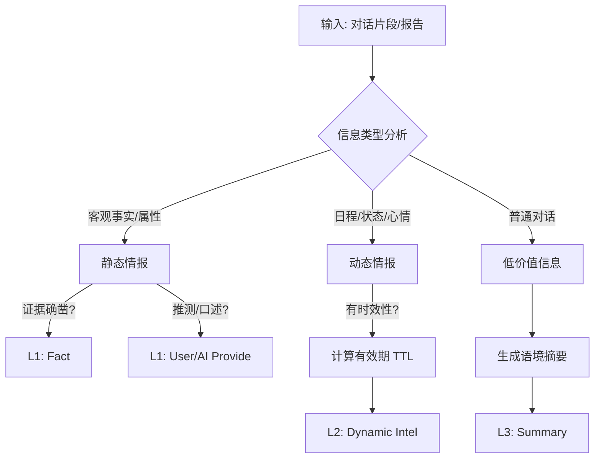

# 上下文提纯策略 (Refining Strategy) v1.0

> **适用版本**：v1.0 (2025-12-30)
> **执行角色**：Organize Agent (整理员), Archiver (归档员)
> **代码对应**：`graph/organize_agent.py`, `graph/archive_manager.py`

本文档定义了将非结构化对话流转化为结构化长期记忆的**提纯逻辑**。这是防止 Context 爆炸、保持 AI 长期智商的关键。

---

## 1. 提纯核心逻辑 (Refining Logic)

提纯不仅仅是"总结"，而是**信息分流 (Information Triaging)**。Organize Agent 需要像一个经验丰富的情报官，迅速判断每一条信息的价值和归属。

### 1.1 决策流程图



---

## 2. 动态情报识别 (Dynamic Intel Recognition)

**动态情报**是指对**当前决策**至关重要，但**随时间衰减**的信息。

### 2.1 识别标准 (Prompt 指南)

| 类别 | 关键词示例 | 提取逻辑 | 默认 TTL (有效期) |
| :--- | :--- | :--- | :--- |
| **Schedule (日程)** | "下周三去上海", "明天加班" | 提取具体日期，过期即删 | 事件结束时间 + 1天 |
| **Mood (心情)** | "最近很烦", "今天超开心" | 提取情绪原因 | 3天 |
| **Status (状态)** | "生病了", "刚分手", "在忙" | 提取状态描述 | 7天 |
| **Intent (意图)** | "想看电影", "在找借口" | 提取潜在需求 | 14天 |

### 2.2 TTL 计算规则

*   **明确时间点**：如 "1月5日去展会"，`expire_at` = `2024-01-06`。
*   **模糊时间点**：如 "下周"，取下周日的次日。
*   **无时间点**：根据类别赋予默认 TTL（见上表）。

---

## 3. 静态情报提取 (Static Intel Extraction)

**静态情报**是关于人与关系的持久化知识。

### 3.1 3×3 矩阵填充流程

Organize Agent 应遵循以下**两步走**逻辑来处理输入数据（对话/报告）：

#### 第一步：信息归类 (Classify by Subject)
判断提取到的信息属于哪个主体：
*   **User Info (用户画像)**: 用户的性格、外貌、职业、过往情感史、个人雷点等。
*   **Crush Info (Crush画像)**: Crush 的性格、喜好、依恋类型、原生家庭、生活习惯等。
*   **Both Info (关系背景)**: 双方的连接点与相处模式。包括但不限于：
    *   关系起点（同事/同学/相亲/网友）
    *   认识时长
    *   互动频率与习惯
    *   共同交集（共同好友/圈子）

#### 第二步：来源定性 (Qualify by Source)
确定主体后，进一步判断信息的来源属性，填入对应格子：
*   **Fact (客观事实)**: 有截图、照片、聊天记录作为直接证据的信息。
*   **User Provide (用户口述)**: 用户主观描述的信息（可能带有滤镜或偏差）。
*   **AI Provide (AI分析)**: AI 基于对话表现推断出的隐性特征（如"用户看似自信实则焦虑"）。

### 3.2 冲突解决 (Conflict Resolution)

当提取的新信息与旧信息冲突时：
1.  **Fact 覆盖一切**：如果是截图/客观行为，直接覆盖旧值。
2.  **新覆盖旧**：如果是观点/推测，保留最新的，旧的直接覆盖。
3.  **累积模式**：对于"爱好"、"习惯"等列表型数据，采用追加模式。

---

## 4. 摘要与归档策略 (Summarization & Archiving)

### 4.1 对话摘要 (Conversation Summary)

当 L3 对话轮次超限触发压缩时，生成摘要的侧重点：
*   ❌ **错误**: "用户问好，AI回复好。用户问吃饭没，AI说吃了。" (流水账)
*   ✅ **正确**: "双方进行了日常寒暄，用户试图发起'美食'话题，但Crush回应冷淡。同时约定了下周三再聊。" (侧重**互动质量**、**关系动态**以及**关键事实/约定**)

### 4.2 报告归档 (Report Archiving)

当生成新报告时，旧报告的 Summary 侧重点：
*   **One-liner**: "L2阶段，推进受阻，缺乏独处机会。" (状态+核心问题)
*   **Mid-Summary**: 包含阶段判定、ACR得分变化、未解决的核心阻碍。

---

## 5. 触发与执行 (Triggers)

| 场景 | 触发器 | 输入数据 | 产出目标 |
| :--- | :--- | :--- | :--- |
| **对话压缩** | `Layer3.turn_count > Limit` | 时间最远的 N 轮原始对话 | L1 Matrix (更新), L2 Intel (新增), L3 Summary (新增) |
| **初始录入** | `Onboarding.completed` | 全量问卷对话 | L1 Matrix (初始化), L2 Intel (初始化) |
| **任务完成** | `Guide.status -> completed` | 用户反馈 + Crush反应 | L1 Both Info (更新), L2 Intel (更新状态) |

---

## 6. Prompt 示例 (For Organize Agent)

```markdown
你是一个敏锐的情报官。你的任务是从用户的聊天记录中提取两类信息：

1. **Static Profile (永久画像)**:
   - 用户的性格、职业、雷点
   - Crush 的性格、喜好、依恋类型
   - 关系的客观事实（认识多久、见过几次）

2. **Dynamic Intel (时效情报)**:
   - 短期内的日程（出差、考试、聚会）
   - 当前的情绪状态（生病、忙碌、开心）
   - **必须估算有效期 (Expire Date)**

请以 JSON 格式输出，不要废话。
```

