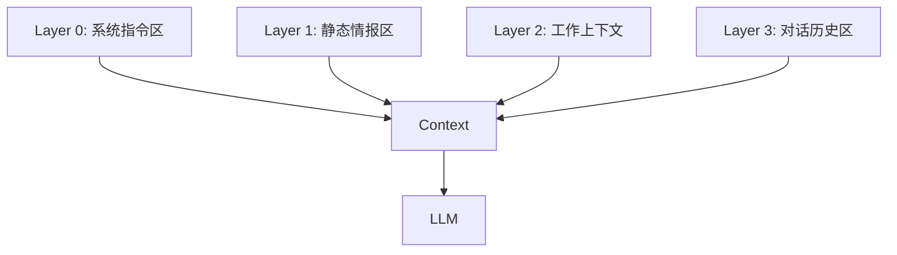

# AI 军师 Agent 上下文工程策略

> ⚠️ **DEPRECATED - 已废弃**
> 
> 本文档已被以下规范文档取代，请参阅：
> - `Layer_Specs/layer1_spec_v1.0.md` - Layer 1 静态情报规范
> - `Layer_Specs/layer2_spec_v1.0.md` - Layer 2 工作上下文规范
> - `Layer_Specs/layer3_spec_v1.0.md` - Layer 3 对话历史规范
>
> 以下内容仅供历史参考，不再维护。

---

> **核心原则**：上下文窗口是稀缺资源。所有进入窗口的信息必须经过计算和筛选，以追求**最高信噪比**。通过分层管理和动态压缩，确保模型既能记住长期关键信息，又能专注于当前任务，同时保持对话的连贯性。

---

## 一、信息分类与存储世界观

我们将用户与 AI 交互产生的所有信息分为两类：**静态情报**（越久越有价值）和**动态信息**（用完即弃）。

### 1.1 静态情报 (Static Intelligence)

这类信息帮助我们**持续积累对用户、Crush、双方关系的深度理解**。它们不随对话流转而消失，而是作为 Agent 的"长期记忆"常驻。

我们采用 **3×3 情报矩阵** 来结构化存储：

| 归属维度 ↓ \ 来源维度 → | 用户提供 (User Provide) | 客观事实 (Fact) | AI分析 (AI Provide) |
| :--- | :--- | :--- | :--- |
| **用户信息** (user_info) | 用户口述的自我描述 | 用户发的朋友圈、照片 | AI推断（如依恋类型、性格） |
| **Crush信息** (crush_info) | 用户描述的Crush | 聊天记录/社媒截图 | AI推断（如性格特征、意图） |
| **双方信息** (both_info) | 用户描述的相处情况 | 互动记录/证据 | AI推断（如关系阶段、L/T） |

**信任优先级**（当信息冲突时）：
1.  **最高可信 - 客观事实 (Fact)**：聊天记录、截图内容、时间戳等直接证据。这是真理。
2.  **中等可信 - AI分析 (AI Provide)**：基于证据的推断。如无新证据反驳，保持沿用。
3.  **最低可信 - 用户提供 (User Provide)**：用户可能美化自己或误读对方。需用客观事实修正。

> **关于"软事实"**：部分用户口述信息虽无直接证据，但客观性强（如"crush是同班同学"、"认识3个月"），可归入「客观事实」或标注为高可信度的用户提供信息。

### 1.2 动态信息 (Dynamic Context)

这类信息对**当前任务执行**至关重要，但随着时间推移，价值会迅速衰减。

| 信息类型 | 定义 | 生命周期 | 处理策略 |
| :--- | :--- | :--- | :--- |
| **工作上下文** | 现状报告、行动规划、行动指南 | 随任务状态变化 | 新版本生成时，旧版本归档摘要 |
| **对话历史** | 用户与 AI 的逐轮对话 | 滚动窗口 | 超出保留轮次后压缩为摘要 |
| **思考过程** | Agent 内部的推理链 (Inner Monologue) | 随任务结束归档 | 仅保留最近的推理，旧推理压缩 |

---

## 二、分层长期记忆架构

为了高效利用 Context Window，我们采用分层架构管理信息。每层都有独立的**长期记忆存储**和**提取策略**。

### Layer 0: 系统指令区 (System Instructions)
*   **定位**：系统的基石，不可动摇。
*   **内容**：
    *   **角色人设**：小话（AI 恋爱军师）的性格与语气。
    *   **核心法则**：ACR 情感物理学、L/T 坐标系定义。
    *   **信任优先级**：Fact > AI > User。
*   **策略**：只读常驻，永不压缩。

### Layer 1: 静态情报区 (Static Intelligence)
*   **定位**：Agent 的大脑记忆区。
*   **内容**：完整的 3×3 情报矩阵。
*   **策略**：
    *   默认模式：完整保留。
    *   更新机制：由 **整理 Agent** 从对话、报告中提取高价值信息，持续追加写入。

### Layer 2: 工作上下文 (Working Context)
*   **定位**：Agent 的案头工作区，存放当前的"作战地图"。
*   **内容**：
    *   **现状分析报告**：当前最新的关系诊断。
    *   **行动规划**：当前的战略目标。
    *   **行动指南（渐进式披露）**：
        *   **in_progress（进行中）**：完整展开（当前最重要）。
        *   **pending/paused/终态（completed/cancelled/expired）**：仅展示元数据（id/title/status/one_liner），需要时由 Agent 通过工具按需加载详情。
*   **历史处理**：
    *   **终态指南（completed/cancelled/expired）**：归档。保留最近 2 个的中等摘要，更早的压缩为一句话摘要。
    *   **旧版报告**：归档。保留最近 2 份的中等摘要，更早的压缩为一句话摘要。

### Layer 3: 对话历史区 (Conversation History)
*   **定位**：Agent 的短期交互记忆。
*   **内容**：
    *   **近期对话**：最近 **25 条** 原始消息（包括用户输入、AI 回复）。
    *   **历史摘要**：超出 25 条的早期对话，被压缩为 **5 条** 高度概括的摘要。
    *   **任务思考 (Scratchpad)**：Agent 对当前任务的内部推理过程（用户不可见，但对 AI 决策至关重要）。仅保留最近 **10 条**。
*   **压缩机制**：
    *   基于**用户轮次**触发。每当用户轮次超过阈值（如 4 轮），且积累了一定数量，触发压缩。
    *   压缩时，调用 **整理 Agent** 提取关键信息至 Layer 1，并将原对话生成摘要存入 Layer 3 头部。

---

## 三、信息生命周期管理：整理 Agent (Organize Agent)

为了防止 Context 爆炸，系统引入了一个后台角色 —— **整理 Agent**。它不直接与用户对话，而是在信息从"热"变"冷"的关键时刻进行处理。

### 3.1 触发时机与职责

| 触发场景 | 触发条件 | 整理 Agent 的动作 | 产出流向 |
| :--- | :--- | :--- | :--- |
| **行动指南完成** | 用户标记任务完成 | 1. 生成任务执行总结 2. 提取用户/Crush新特征 | Layer 2 (历史摘要) Layer 1 (静态情报) |
| **现状报告更新** | 生成了新的诊断报告 | 1. 概括旧报告核心结论 2. 提取关系变化洞察 | Layer 2 (历史摘要) Layer 1 (静态情报) |
| **对话滚动压缩** | 对话轮次超限 | 1. 生成对话摘要 2. 提取事实性信息 | Layer 3 (对话摘要) Layer 1 (静态情报) |
| **任务思考过长** | 推理链条 > 10 条 | 1. 总结之前的推理逻辑 2. 压缩旧推理 | Layer 3 (任务摘要) |

### 3.2 归档价值

通过整理 Agent，我们将大量非结构化的闲聊和过程信息，转化为了：
1.  **高密度的摘要**：保留上下文线索。
2.  **结构化的情报**：丰富用户画像（Layer 1）。

这实现了"越聊越懂你"的效果，同时保持了极低的 Token 占用。

---

## 四、Token 预算策略

为了确保在主流模型（如 Claude 3.5, GPT-4o）上获得最佳性能与成本平衡，我们设定了如下预算（估算值）：

*   **总预算上限**：70,000 Tokens
*   **Layer 0 (系统)**：4,000 (固定)
*   **Layer 1 (静态)**：15,000 (高价值信息核心)
*   **Layer 2 (工作)**：20,000 (当前任务相关度最高)
*   **Layer 3 (对话)**：15,000 (保持最近交互的鲜活性)
*   **预留输出**：8,000

---

## 五、特殊数据处理：Crush 聊天记录

用户上传的 Crush 聊天记录（截图/文本）是核心资产，但体积巨大。我们采用独立的分层存储策略：

1.  **L1 元数据 (常驻)**：总条数、聊天频率、最后联系时间。让 Agent 只有概况感。
2.  **L2 结构化摘要 (常驻)**：关键事件、情感转折点、高频话题。让 Agent 懂关系脉络。
3.  **L3 关键片段 (按需)**：最近 20 条、标记为"重要"的消息。仅在需要分析聊天时调入。
4.  **L4 全量检索 (按需/规划中)**：通过语义搜索查找特定话题的聊天记录。

---

## 六、版本记录

*   **v1.0**: 初始版。定义分层架构。
*   **v3.0**: 引入 3×3 矩阵，移除统一的 Layer 4，改为各层独立长期记忆。
*   **v3.1**: 
    *   明确 Layer 3 对话压缩基于"用户轮次"触发。
    *   引入任务思考 (Rolling Scratchpad) 的压缩机制。
    *   确立了"整理 Agent"作为信息清洗工的核心地位。
    *   细化了 Crush 聊天记录的分层策略。
