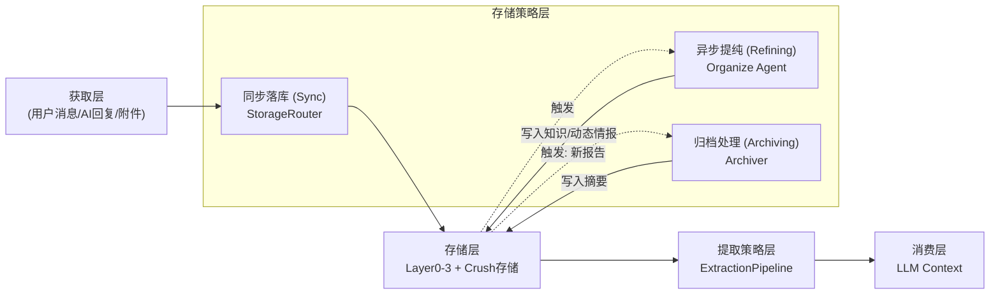

# 上下文工程架构（获取 → 存储/提纯 → 存储层 → 提取 → 消费）

> 适用版本：v3.1 技术实现（`graph/context_builder.py`、`graph/storage_strategy.py`、`graph/organize_agent.py`、`graph/archive_manager.py`）

## 1. 数据流总览

关键思想：**双模态存储 + 自动归档**。
1.  **同步落库**：即时响应，存入 L2/L3 原生层级。
2.  **异步提纯**：`Organize Agent` 提取 L1 (静态知识) 和 L2 (动态情报)。
3.  **自动归档**：`Archiver` 在新报告生成时，自动为旧报告生成摘要。

## 2. 核心模块映射

| 层 | 角色 | 代码位置 | 说明 |
| --- | --- | --- | --- |
| **存储策略** | **Sync Router** | `graph/storage_strategy.py` | **前台调度**。决定数据第一时间落在哪（L2/L3）。 |
| **提纯回路** | **Refiner** | `graph/organize_agent.py` | **后台炼金**。提取知识 (L1) 和 动态情报 (L2 Intel)。 |
| **归档处理** | **Archiver** | `graph/archive_manager.py` | **历史维护**。生成旧报告摘要，压缩超长对话。 |
| **存储层** | Layer1 Memory | `graph/context_types.py` | 静态情报（3×3矩阵）。 |
| **存储层** | Layer2 Memory | `graph/context_types.py` | 动态工作区（报告/指南/动态情报板）。 |
| **提取策略** | ExtractionPipeline | `graph/extraction_strategy.py` | 组装上下文，动态裁剪 L1/L2/L3。 |

## 3. 存储与提纯策略

### 3.1 同步落库 (StorageRouter)
- `user_message` / `assistant_message` → **Layer 3** (追加)
- `status_report` / `action_plan` → **Layer 2** (新增版本)
- `action_guide` → **Layer 2** (追加/更新状态)

### 3.2 异步提纯 (Organize Agent)
- **Layer 3 → Layer 1**: 提取 3x3 静态画像 (User/Crush/Both)。
- **Layer 3 → Layer 2 Dynamic Intel**: 提取时效性信息（如"下周出差"、"当前心情"）。

### 3.3 归档处理 (Archiver)
- **Trigger**: 生成新 StatusReport / ActionPlan 时。
- **Action**: 为上一份报告生成 `summary` 和 `one_liner`，写入 L2。

## 4. 提取策略（ExtractionPipeline）

Pipeline 负责在 Token 预算内，根据当前 Agent 的意图组装 Context：

- **L0 (System)**: 必选，人设与核心理论。
- **L2 (Working)**:
    - 必选：当前 StatusReport/ActionPlan。
    - **必选：Dynamic Intel (动态情报板)**。
    - 可选：历史报告的 Summary (由 Archiver 生成)。
- **L1 (Profile)**: 必选，核心画像（3×3矩阵）。
- **L3 (History)**: 可选，最近 N 轮对话。

## 5. 数据流示例

1.  **获取**: 用户说 "下周三要去上海见她"。
2.  **同步**: 存入 L3。
3.  **提纯**: `Organize Agent` 识别出这是时效性信息。
    - 写入 L2 `Dynamic Intel`: "下周三(日期)去上海见Crush"，有效期至下周四。
4.  **消费**: 周一生成行动指南时，`Guide Agent` 读取 L2 `Dynamic Intel`，建议 "提前准备好去上海的礼物"。
5.  **归档**: 生成新指南后，`Archiver` 将旧的已完成指南归档摘要。

## 6. 扩展指南

- **Dynamic Intel**: 在 L2 Memory 中新增结构，支持 `expire_at` 字段。
- **Archiver**: 实现独立的 `summarize_report(report)` 方法。

## 7. 兼容性

- 保持 `LayerXMemory` 结构不变。
- **新增** Layer 2 的 `dynamic_intels` 列表字段。
