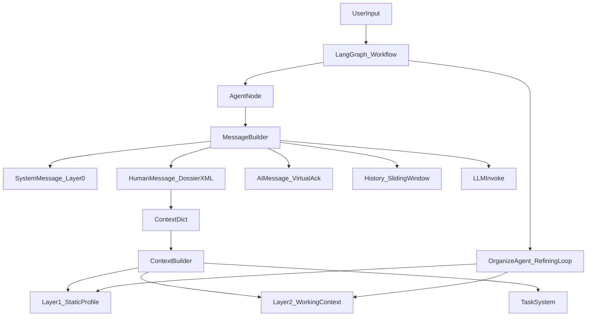

# 上下文系统全景图（System Overview）

> 本文档说明上下文系统的完整逻辑：信息从哪来、怎么存、怎么沉淀、怎么取、怎么组装进模型输入，以及各模块如何协作。

---

## 一、信息生命周期（从产生到被模型使用）

一条信息从出现到影响模型输出，会经历下面 5 个阶段：

```text
① 产生 → ② 写入 → ③ 提纯/归档 → ④ 提取 → ⑤ 注入（消息栈）
```

| 阶段 | 发生什么 | 谁负责 | 关键产物 |
|:---|:---|:---|:---|
| **① 产生** | 用户发文本/图片；子 Agent 产出报告/规划/指南；工具返回结果 | 用户 / Agents / Tools | 原始消息、报告、指南、工具输出 |
| **② 写入** | 先把原始内容落到“原生层级”，确保不丢不阻塞 | Storage/Workflow | Layer 3 消息流；Layer 2 当前报告/规划/指南等 |
| **③ 提纯/归档** | 从原始内容中提取“长期有用/短期时效”的信息；生成摘要；控制无限增长 | Organize Agent（整理回路） | Layer 1 画像、Layer 2 动态情报与历史摘要、Layer 3 历史摘要 |
| **④ 提取** | 每次调用模型前，从各层取出“此刻最有用”的部分 | Context Builder | 上下文字典（结构化） |
| **⑤ 注入** | 把提取结果按固定顺序组装为标准消息栈 | Message Builder | SystemMessage + `<dossier>` + Virtual Ack + History + Current Input |

---

## 二、核心模块与职责（你可以把它当作系统的“器官图”）

| 模块 | 职责 | 典型入口 |
|:---|:---|:---|
| **Message Builder** | 构造模型调用的标准消息栈；过滤历史；放置 Virtual Ack | `agent_impl/graph/message_builder.py` |
| **Context Builder** | 从 Layer 1/2/3 提取并格式化；产出 context_dict | `agent_impl/graph/context_builder.py` |
| **Organize Agent** | 从对话/报告/指南中提取高价值信息；生成摘要与归档 | `agent_impl/graph/nodes/organize_agent.py` |
| **Task Tools** | 任务生命周期（create/switch/complete/append_note）；输出 Task Index | `agent_impl/graph/tools/task_tools.py` |
| **Context Loader** | 按需加载并绑定额外上下文（Bound Contexts）到当前任务 | `agent_impl/graph/tools/context_loader.py` |
| **State（AgentState）** | 工作流中的统一状态容器（分层长期记忆 + 消息流 + 路由控制） | `agent_impl/graph/state.py` |

---

## 三、端到端数据流（一次模型调用到底发生了什么）



你可以把它理解成两条闭环：
- **主闭环（每轮必走）**：提取 → 组装 → 调用模型 → 输出
- **整理闭环（按需触发）**：从原始信息中提纯与归档，保证系统长期可持续

---

## 四、组装顺序与“稳定内容优先”

系统遵循一个很朴素但非常重要的原则：

> **越稳定的内容越靠前，越容易变化的内容越靠后。**

理由：
- **KV Cache 复用**：头部稳定，模型缓存复用率更高，成本更低
- **指令遵循更稳**：规则在前，背景在中，当前输入在最后，输出更不容易跑偏

2.0 的具体顺序与 Token 预算请直接读：`../02_Specs/context_assembly_spec_v2.0.md`。

---

## 五、一个完整场景走一遍（新人最容易建立直觉的方式）

**场景**：用户上传截图：“她说‘最近有点忙’”，用户问“是不是在拒绝我？”

### Step 1：写入（先留住原始信息）
- 用户文本与截图解析结果进入 Layer 3（消息流），不做复杂加工，避免阻塞。

### Step 2：调用模型前组装（让模型“看见重点”）
- Message Builder 构造消息栈：
  - SystemMessage：角色与规则（Layer 0）
  - `<dossier>`：画像（Layer 1）+ 当前报告/规划/指南/动态情报 + 任务信息（Layer 2 + Task）
  - Virtual Ack：固定确认
  - History：最近 N 轮对话（含工具消息），保证语境连贯
  - Current Input：本轮问题

### Step 3：模型输出（主控 Agent 决策）
模型基于规则与上下文判断：这句话可能是“真实忙/委婉拒绝/试探”，并给出下一步建议。

### Step 4：整理回路（把“长期有用”的沉淀下来）
当满足触发条件（例如对话超限需要压缩、报告被新版本替换、指南进入终态等），Organize Agent 会：
- 抽取：把“长期画像”写入 Layer 1，把“短期态势”写入 Layer 2 动态情报
- 归档：把旧内容压缩成摘要，放入历史区域，控制无限增长

---

## 六、常见误解（新人最容易踩的坑）

1. **“把全部聊天记录塞给模型就行”**  
不可行：输入窗口有上限，且越长越慢越贵；更关键的是，噪音越多，模型越容易偏离任务。

2. **“Layer 1 存所有结论（包括关系阶段/ACR 等）”**  
不建议：关系阶段、ACR、核心问题属于“随任务变化”的工作结论，更适合留在 Layer 2 的报告/规划里；Layer 1 更像长期画像与事实档案。

3. **“行动指南必须全部展开”**  
不行：指南可能很多，全部展开会把 Token 打爆；系统采用渐进式披露：只展开少量进行中的指南，其他只注入索引与摘要，需要时用 `context_loader` 拉取细节。

---

## 七、接下来读什么

- 想看**消息栈**与过滤规则：`../02_Specs/message_stack_spec_v2.0.md`
- 想看 `<dossier>` **字段与最小输入**：`../02_Specs/message_input_spec_v2.0.md`
- 想写/改某一层：`../02_Specs/layer1_spec_v2.0.md`、`layer2_spec_v2.0.md`、`layer3_spec_v2.0.md`
- 想理解“任务与按需上下文”：`../02_Specs/task_system_spec_v2.0.md`

