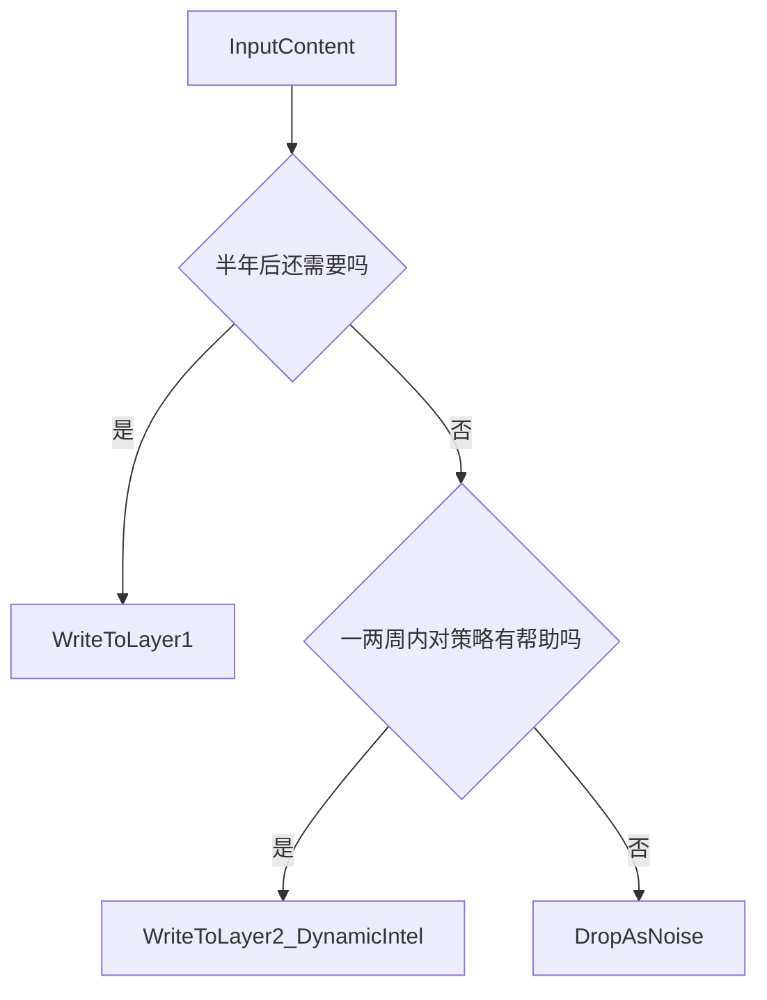

# 信息价值过滤标准（Value Filter Spec v2.0）

> 目的：定义什么信息值得进入长期记忆（Layer 1），什么只适合短期态势（Layer 2），什么必须过滤掉（不记录）。  
> 一句话原则：**“半年后这条信息还有用吗？”**

---

## 1. 三级价值定义

### 1.1 高价值（必须记录到 Layer 1）

定义：能长期稳定地帮助系统理解用户/Crush/关系的信息。

典型类别（满足任意一条即可）：
- **身份属性**：姓名、年龄、职业、学历、家庭背景
- **稳定性格与沟通风格**：依恋类型、沟通偏好、行为模式
- **长期偏好与边界**：兴趣爱好、生活习惯、价值观、雷区、择偶标准
- **关系背景**：认识方式、认识时长、共同圈子
- **里程碑事件**：第一次约会/表白/关键冲突/明确态度表达

落点：Layer 1（3×3 情报矩阵）

---

### 1.2 中价值（记录到 Layer 2 动态情报）

定义：短期内对决策有帮助，但会随时间衰减的信息。

典型类别：
- 日程安排（出差、加班、考试）
- 当前情绪（压力大、低落、兴奋）
- 临时状态（生病、很忙、在旅行）
- 近期意向（想约饭、准备表白、准备冷处理）

落点：Layer 2 `dynamic_intels`（必须有 `expire_at`）

---

### 1.3 低价值（不记录）

定义：对理解人物/关系没有帮助的信息（噪音）。

典型类别：
- 语气词/口头禅/礼貌用语（“哈哈哈”“好的”“行”“对对对”）
- 无关闲聊（天气、新闻、娱乐八卦）
- 模糊表达且无信息量（“就那样吧”“你猜”“那种感觉”）
- AI 的长篇策略论述（应体现在当轮输出或工作产物，而不是长期记忆）

处理：直接过滤（不进入 L1/L2）

---

## 2. 决策流程（可直接给 Organize Agent 使用）

---

## 3. 常见误判与纠偏

1. **把“关系阶段/ACR/核心问题”写进 Layer 1**  
这些通常随任务推进而变化，应体现在 Layer 2 的报告/规划里；Layer 1 更像画像与事实档案。

2. **把“当下情绪/忙不忙”写进 Layer 1**  
这类信息会过期，应进入 Layer 2 动态情报并设置过期时间。

3. **把“对话里的废话”写进 Layer 1**  
长期记忆一旦污染，会持续干扰判断并浪费 Token；宁可少记，也不要乱记。

