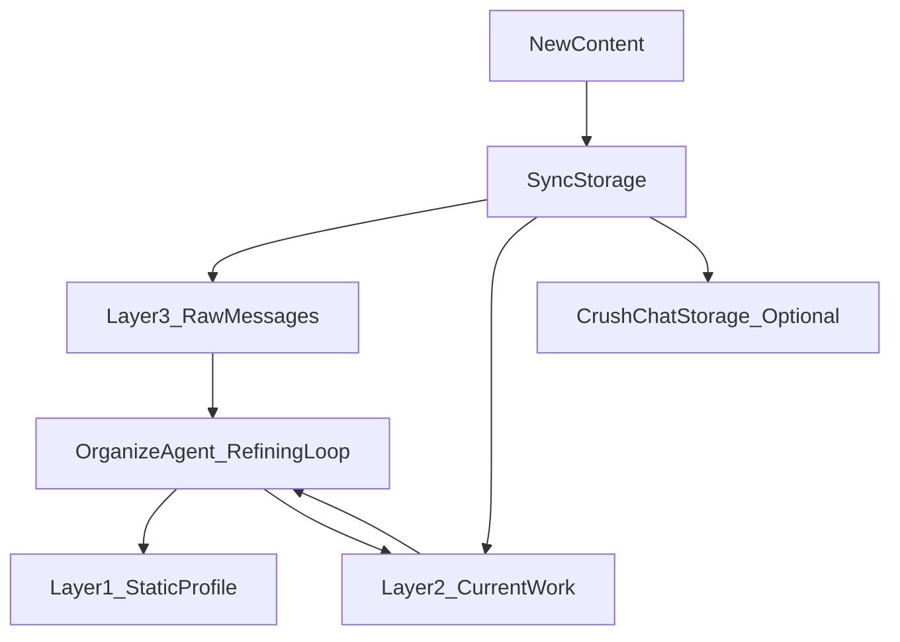

# 存储策略（Storage Strategy v2.0）

> 目的：定义“信息产生后如何写入分层长期记忆”的策略，确保交互不阻塞、数据不丢失、长期记忆不被噪音污染。

代码对应：
- 路由与写入助手：`agent_impl/graph/storage_strategy.py`
- 归档与压缩入口：`agent_impl/graph/archive_manager.py`
- 提纯回路（LLM）：`agent_impl/graph/nodes/organize_agent.py`

---

## 1. 核心理念：同步落库 + 异步提纯

系统采用“双回路”：

1) **同步落库（Sync Storage）**：追求快，保证不丢不阻塞  
2) **异步提纯（Async Refining）**：追求准与干净，把“高价值信息”沉淀为结构化长期记忆

---

## 2. 同步落库：写入“原生层级”

同步落库强调“先把原始信息留住”，不做复杂推理。

### 2.1 交互信息流（用户消息、AI 回复、工具输出）

- **目标层级**：Layer 3（对话消息流）
- **写入动作**：append（追加）
- **目的**：保证对话连贯性与可追溯性（后续提纯/压缩都以此为源）

### 2.2 工作产物（报告/规划/指南）

- **目标层级**：Layer 2（工作上下文）
  - `current_status_report`
  - `current_action_plan`
  - `action_guides`
- **写入动作**：
  - 报告/规划：写入 current，旧版本进入 history（并等待归档生成摘要）
  - 指南：创建时追加（默认 `in_progress`），状态变化时更新对应条目

### 2.3 动态情报（短期态势）

- **目标层级**：Layer 2 `dynamic_intels`
- **写入动作**：upsert（按语义/引用去重，必要时覆盖）
- **硬要求**：必须带 `expire_at`（过期才会在注入时被过滤）

---

## 3. 异步提纯：沉淀“长期有用的信息”

提纯回路的输入来自：
- 即将被压缩的对话片段（Layer 3）
- 被替换的旧报告/旧规划（Layer 2）
- 进入终态的行动指南（Layer 2）

提纯回路的产出主要写入：
- **Layer 1（长期画像）**：3×3 情报矩阵（长期有效）
- **Layer 2（短期态势）**：动态情报（有时效）
- **Layer 2（历史摘要）**：报告/规划/指南摘要（summary/one_liner）
- **Layer 3（历史摘要）**：对话摘要（topics + summary）

> 提纯规则与价值过滤见：`../Refining_Strategy/refining_strategy_v2.0.md`、`../Extraction_Strategy/value_filter_spec_v2.0.md`。

---

## 4. 存储路由（内容类型 → 目标层级）

路由器实现：`StorageRouter.route()`。其核心思想是：按内容语义把“原始/结构化/摘要”分别落到最合适的层。

典型映射：
- 静态情报（fact/analysis/insight）→ Layer 1
- 工作产物（status_report/action_plan/action_guide）→ Layer 2
- 动态情报（dynamic_intel）→ Layer 2
- 对话消息与对话摘要（user_message/assistant_message/conversation_summary）→ Layer 3
- Crush 聊天库（crush_chat）→ CrushChatStorage（可选）

---

## 5. 关键约束（避免“越用越坏”）

1. **同步落库永远不做重推理**：推理应放在异步提纯回路，避免卡住用户体验。
2. **Layer 1 只存半年后仍有用的信息**：噪音一旦进入长期记忆，会长期消耗 Token 干扰判断。
3. **动态情报必须有过期时间**：否则会永久影响决策，造成“过期态势误导”。

