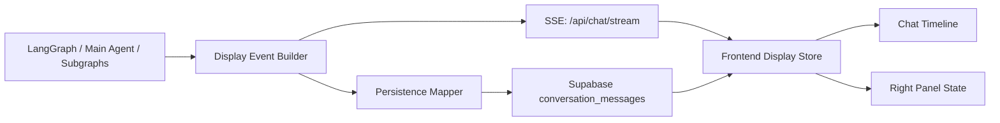

# 前端展示技术方案

> 基于需求文档：`agent_impl/docs/frontend_display_requirements_spec.md`  
> 版本：v1.0  
> 日期：2026-04-17  
> 状态：待评审

---

## 1. 方案目标

本方案用于落地前端展示需求规格中的 R1-R8，重点解决以下 3 个核心问题：

1. 聊天流节点展示不完整，部分中间过程被吞掉或只在刷新后出现。
2. 实时流和刷新恢复使用两套不同的拼装逻辑，导致顺序不稳定、卡片位置漂移。
3. 报告、提问卡片、工具调用、reasoning 等节点缺少统一的数据模型，前后端只能靠内容推断和去重规则勉强拼接。

目标不是重做整套聊天 UI，而是在现有 `agent_impl/frontend/index.html` 和现有会话持久化链路上，建立一套统一、可排序、可持久化的“展示事件 -> 展示节点”架构。

---

## 2. 现状与问题

### 2.1 当前实现概览

当前前端展示链路主要由以下几部分组成：

- 实时流处理：`agent_impl/api/stream.py`
- 主 Agent 过程事件发射：`agent_impl/graph/nodes/main_agent.py`
- 流式结果落库：`agent_impl/api/conversation_persist.py`
- 历史消息读取：`agent_impl/api/conversations.py`
- 前端展示与恢复：`agent_impl/frontend/index.html`

当前聊天区主要依赖三套来源：

1. `process_event`
   - 实时展示 reasoning、tool_call、ai_message、report_ready。
2. `final.pending_responses`
   - 流结束后再统一补 assistant 文本、system_task 卡片、提问卡片。
3. `/api/conversations/{id}/messages`
   - 刷新后把 Supabase 消息重新映射成 UI 消息。

### 2.2 当前问题定位

#### 问题 A：实时展示和历史恢复不是同一个真源

实时链路中，前端通过 `handleProcessEvent()`、`pushPendingResponsesDedup()`、`processStateUpdate()` 三套逻辑共同改写 `messages.value`。  
刷新链路中，则通过 `_mapSupabaseMessageToUI()` 和 `normalizePersistedHistoryMessages()` 重新“猜测”历史节点。

结果是：

- 同一个业务节点，实时时是 A 结构，刷新后变成 B 结构。
- 报告卡片、工具卡片、inquiry 卡片会出现顺序不一致或重复/丢失。
- 前端不得不依赖大量内容去重规则，维护成本高。

#### 问题 B：SSE 没有稳定排序键

当前 `/api/chat/stream` 发出的 `process_event` 和 `final` 事件不带统一的 `seq` 字段。  
前端只能按“收到就 push”的方式追加消息，无法保证以下场景稳定：

- 一个 tool_call 完成后，report 卡片晚到，插入位置可能漂移。
- 子图中间消息和最终报告可能在前端展示时交错错位。
- 刷新后依赖持久化 `seq`，而实时阶段却没有相同排序依据。

#### 问题 C：子图中间思考没有真正流式输出

当前 `status/plan/guide` 子图的中间消息最终会通过 `_subgraph_intermediates` 汇总进 `pending_responses`，但不会在子图执行时实时发给前端。  
这与需求文档 2.2 / R1 / R2 不一致，也是当前最大的后端缺口。

#### 问题 D：`pending_responses` 被过度承担展示职责

`pending_responses` 本质上更适合表达“本轮最终应推给用户的结构化结果”，不适合承担完整的过程事件总线。

如果继续把它作为聊天展示的唯一真源，会天然遇到：

- loading 态无法可靠持久化和恢复为最终态。
- tool_call calling/done、report loading/done 这类状态迁移很难统一表达。
- 子图 thinking、reasoning、intermediate text 只能靠额外旁路事件补。

结论：`pending_responses` 应保留给业务结果聚合，不再作为展示架构的唯一真源。

---

## 3. 设计原则

### 3.1 一个真源

前后端统一使用“展示事件 Display Event”驱动聊天时间线，实时流和历史恢复都还原成同一套 `DisplayNode`。

### 3.2 顺序显式化

所有需要进聊天流的节点都必须带 `seq`。前端永远按 `seq` 排序和更新，不再按“收到顺序”直接 `push`。

### 3.3 节点可更新而非只能追加

同一个业务节点允许状态升级：

- tool_call: `loading -> done/error`
- report_card: `loading -> done`
- inquiry_card: `new -> submitted`

因此事件需要稳定 `node_id`，前端对同一节点做 upsert，而不是每次创建新消息。

### 3.4 面板与聊天解耦，但使用同一业务标识

报告卡片只展示轻量摘要，完整报告仍在右侧面板展示。聊天卡片和右侧面板共享 `report_type` / `report_id` / `panel_target`，避免跳转靠文案猜测。

### 3.5 历史恢复等价于“重放最终节点”

刷新后不恢复过程动画，只恢复最终节点状态和顺序。  
因此持久化层只存最终展示态，不存瞬时动画态。

---

## 4. 目标架构



架构核心变化：

1. 后端增加统一的 `Display Event Builder`，把 reasoning、子图思考、tool、report、inquiry、final 统一成事件。
2. 流式 SSE 和落库都使用同一份事件语义。
3. 前端增加 `Display Store`，所有实时事件和历史记录都先转成 `DisplayNode`，再渲染。

---

## 5. 统一数据模型

## 5.1 Display Event

建议后端统一发出如下事件结构：

```json
{
  "type": "display_event",
  "seq": 12005,
  "turn_id": "8a7f...",
  "turn_seq": 12,
  "node_id": "tool:call_status_agent:tc_001",
  "node_type": "tool_call",
  "status": "loading",
  "source": "main_agent",
  "created_at": "2026-04-17T10:21:00Z",
  "payload": {
    "tool_name": "call_status_agent",
    "tool_label": "分析感情现状"
  }
}
```

字段定义：

- `seq`: 当前会话内严格递增排序键，前端唯一排序依据。
- `turn_id`: 当前轮唯一标识，用于轮次折叠和 turn grouping。
- `turn_seq`: 第几轮，便于调试和历史恢复。
- `node_id`: 节点唯一标识，同一节点的状态升级必须复用同一 `node_id`。
- `node_type`: 节点类型，见 5.2。
- `status`: 节点状态，部分类型可为空。
- `source`: 事件来源，如 `main_agent` / `status_agent` / `plan_agent` / `guide_agent` / `system`。
- `payload`: 节点展示所需的数据。

## 5.2 Node Type 枚举

统一定义以下节点类型：

| node_type | 对应需求节点 | 是否持久化 | 说明 |
|-----------|--------------|-----------|------|
| `user_message` | 用户消息 | 是 | 聊天气泡 |
| `reasoning` | 2.1 | 是 | 折叠卡片，刷新后默认折叠 |
| `subgraph_thinking` | 2.2 | 是 | 标注来源子图 |
| `tool_call` | 2.3 | 是 | 只持久化最终态 |
| `report_card` | 2.4 | 是 | loading/ready 两态 |
| `inquiry_card` | 2.5 | 是 | 未回答可交互，已回答显示提交态 |
| `inquiry_receipt` | 需求补充 | 是 | 用户提交问卷后的回执 |
| `ai_intermediate` | 2.6 | 是 | 普通文本气泡或折叠块 |
| `final_response` | 2.7 | 是 | 标准助手消息 |

说明：

- `inquiry_receipt` 不在需求文档 2.1-2.7 内，但当前产品已经存在，且对刷新恢复很重要，建议纳入统一节点模型。
- `report_card` 与右侧面板是“一份数据，两种视图”，不再依赖 `processStateUpdate` 临时拼卡。
- 命名约定上，本文统一使用 `plan` 表示“行动策略报告”；若需兼容当前前端旧字段 `taskType=strategy`，在适配层做一次映射即可。

## 5.3 Display Node

前端内部统一存储为 `DisplayNode`：

```ts
type DisplayNode = {
  seq: number
  turnId: string
  nodeId: string
  nodeType: string
  status?: string
  source?: string
  payload: Record<string, any>
}
```

前端渲染层不再直接操作原始 SSE chunk，也不直接操作 `pending_responses`。

---

## 6. 后端方案

## 6.1 在流式接口中引入统一序列号

### 方案

在 `agent_impl/api/stream.py` 中新增当前轮的 `DisplaySeqAllocator`，负责：

1. 在流开始时创建/预留当前 turn。
2. 获取 `turn_seq`。
3. 为本轮每个展示节点分配 `part_index`。
4. 生成 `seq = turn_seq * 1000 + part_index`。

### 建议实现

- 登录态请求：
  - 在 stream 开始前调用 `upsert_conversation + get_or_create_turn`。
  - 直接拿到 `turn_seq`，与落库使用同一序列基准。
- 若未来支持匿名流式持久化：
  - 额外引入线程级 turn counter。
  - 但不阻塞本期 P0 实现。

这样可以保证：

- 实时流里的 `seq`
- Supabase `conversation_messages.seq`
- 刷新恢复后的排序

三者完全一致。

## 6.2 引入 Display Event Builder

建议新增统一构造器，例如：

- `agent_impl/api/display_events.py`

职责：

1. 定义 node type 和 payload schema。
2. 负责把内部事件映射成可展示事件。
3. 为 tool_call/report_card/inquiry_card 生成稳定 `node_id`。
4. 负责工具中文名称映射。

工具名中文映射不应只放前端，建议后端和前端共享同一张映射表，避免历史消息恢复和实时展示不一致。

## 6.3 实时事件发射策略

### A. Reasoning

来源：`main_agent.py` 中 `_emit_ai_events()`  
动作：保留现有提取逻辑，但统一改为发 `display_event(node_type="reasoning")`。

### B. AI Intermediate

来源：`_emit_ai_events()` 中无 tool call 的 AI 文本  
动作：发 `display_event(node_type="ai_intermediate")`。

### C. Tool Call

来源：`_emit_ai_events()` 和 `_emit_tool_done_from_message()`  
动作：

- 工具开始：发 `tool_call/loading`
- 工具完成：对同一 `node_id` 发 `tool_call/done` 或 `tool_call/error`

`node_id` 建议使用：

- `tool:${tool_call_id}`，若缺失则退化为 `tool:${tool_name}:${local_counter}`

### D. Report Card

来源：子图调用和 submit 工具完成

动作分两段：

1. 报告开始生成时发 `report_card/loading`
2. 报告完成时发 `report_card/done`

建议触发点：

- `call_status_agent` 开始时：`report_type=status`
- `call_plan_agent` 开始时：`report_type=plan`
- `call_guide_agent` 开始时：`report_type=guide`
- 对应 submit 工具真正写入新报告后：升级为 `done`

这样可以满足“聊天流中既看到工具调用，也看到报告生成进度”。

### E. Inquiry Card

来源：`ask_human` interrupt  
动作：

- 发 `inquiry_card/new`
- 若本轮用户 resume 提交回答，则在下一轮持久化 `inquiry_receipt`

### F. Final Response

来源：`main_agent_node()` 最终文本  
动作：统一发 `final_response` 节点，而不是依赖 `pending_responses` 兜底显示。

## 6.4 子图中间思考流式化

这是本方案的关键后端依赖。

当前状态：

- `status/plan/guide` 子图的 `intermediate_messages` 只在子图完成后被汇总到 `_subgraph_intermediates`。
- 前端拿不到子图执行中的实时 thinking。

建议改造：

1. 在子图 supervisor 执行过程中就通过 `get_stream_writer()` 发射 `subgraph_thinking`。
2. 事件中带 `source=status_agent|plan_agent|guide_agent`。
3. 完成后仍可保留最终汇总，但前端不再依赖汇总做首次展示。

目标效果：

- 子图每产生一条中间 AI 消息，聊天流立即出现对应折叠卡片。
- 刷新后从持久化节点恢复为最终静态卡片。

## 6.5 `pending_responses` 的角色调整

建议保留 `pending_responses`，但职责收敛为：

- 业务层输出聚合
- 非展示流程兼容
- 旧接口兼容期兜底

不再把 `pending_responses` 作为聊天区主渲染真源。

推荐新增最终事件：

```json
{
  "type": "final",
  "turn_id": "...",
  "turn_seq": 12,
  "display_nodes": [...],
  "state": {...}
}
```

其中：

- `display_nodes` 用于前端收尾校准和补漏
- `state` 继续用于右侧面板刷新

## 6.6 持久化方案

### 原则

持久化层应写入“最终展示节点”，不要再从 `pending_responses + process_events + final_state` 临时拼装三次。

### 方案

`agent_impl/api/conversation_persist.py` 改为接收本轮 `display_nodes`，按统一规则写入 `conversation_messages`。

字段建议：

- `kind`: 直接使用统一 node type
- `content`: 文本类节点正文
- `metadata`: 其余展示字段，如 `status`、`panel_target`、`tool_label`、`report_type`、`inquiry_card`
- `seq`: 使用与流式相同的 `seq`

结论：本期不强依赖 Supabase 表结构变更，优先复用现有 `kind + content + metadata + seq`。

如后续需要更强查询能力，可再补充：

- `node_id`
- `node_type`
- `status`

但这不是本次 P0 阻塞项。

---

## 7. 前端方案

## 7.1 新增 Display Store

建议在 `agent_impl/frontend/index.html` 中抽出一层展示数据管理，不再直接在多个函数里 `messages.value.push(...)`。

建议结构：

- `displayNodeMap: Map<nodeId, DisplayNode>`
- `displaySeqList: number[]`
- `turnGroupMap: Map<turnId, TurnGroup>`
- `messagesView: computed(() => flattenTurnGroups(...))`

### 核心接口

- `applyDisplayEvent(event)`
- `applyDisplayNodes(nodes)`
- `hydrateFromHistory(nodes)`
- `rebuildTurnGroups()`

## 7.2 渲染策略

前端渲染不再区分“实时消息”和“历史消息”，统一流程为：

1. SSE / 历史 API 都先转为 `DisplayNode`
2. `DisplayStore` 按 `seq` 插入或更新
3. 视图层从 `DisplayStore` 派生 `messagesView`

这样可以消除以下函数的职责重叠：

- `handleProcessEvent`
- `pushPendingResponsesDedup`
- `normalizePersistedHistoryMessages`
- `_mapSupabaseMessageToUI`

它们可保留为兼容层，但最终都应汇聚到 `applyDisplayEvent` / `hydrateFromHistory`。

## 7.3 节点 upsert 规则

### Tool Call

- 以 `node_id` 为主键 upsert
- `loading -> done/error` 更新同一节点
- 刷新恢复后直接显示 done/error

### Report Card

- `loading -> done` 更新同一节点
- `done` 态必须包含 `panel_target`
- 点击后跳转右侧面板

### Inquiry Card

- `new` 态可交互
- 若存在已提交回执，则 inquiry 节点转为 `submitted`，显示答案摘要或禁用态

## 7.4 右侧面板跳转

结合当前实现，右侧面板实际是两个一级 Tab：

- `status`
- `plan`

因此建议映射为：

| report_type | panel_target |
|-------------|--------------|
| `status` | `status` |
| `plan` | `status#plan-analysis` |
| `guide` | `plan` |

说明：

- 若当前 UI 仍使用旧字段 `strategy`，则在前端适配层统一映射到 `plan`。
- `plan` 报告目前属于“当前现状”页签下的“总体规划”模块，因此跳转到 `status#plan-analysis` 更符合现有 UI。
- `guide` 卡片跳转到 `plan` Tab，并聚焦对应 `guide_id`。

## 7.5 轮次折叠

前端在 `DisplayStore` 里按 `turn_id` 构建 `TurnGroup`：

```ts
type TurnGroup = {
  turnId: string
  userNode?: DisplayNode
  intermediateNodes: DisplayNode[]
  finalNode?: DisplayNode
  collapsed: boolean
}
```

折叠规则：

- 折叠后只显示用户消息和 `final_response`
- `reasoning / subgraph_thinking / tool_call / report_card / ai_intermediate` 进入 intermediate 区
- 默认展开
- 折叠状态只保存在前端内存，不持久化

## 7.6 输入锁定

新增统一计算状态：

```ts
const inputLockReason = computed(() => {
  if (streamActive.value) return 'streaming'
  if (hasPendingInquiry.value) return 'pending_inquiry'
  return null
})
```

UI 规则：

- `streaming`: 输入框禁用，placeholder 显示“正在处理中...”
- `pending_inquiry`: 输入框禁用，placeholder 显示“请先回答上方问题”
- 发送按钮和图片上传按钮一并禁用

这样比当前仅依赖 `isLoading` 更准确，也能覆盖“等待用户回答 inquiry card”场景。

## 7.7 工具名称中文化

前端不再直接展示 `event.tool_name`。  
统一使用 `tool_label`，若缺失则按映射表转换，仍缺失则显示“执行操作”。

映射建议优先级：

1. 后端直接返回 `tool_label`
2. 前端本地映射表兜底
3. 未匹配显示“执行操作”

---

## 8. 实施步骤

## 8.1 Phase 1 - P0 后端事件模型

目标：

- 给所有展示事件加 `seq`
- 引入 `display_event`
- 流式输出 tool/reasoning/final 的统一节点

改动文件：

- `agent_impl/api/stream.py`
- `agent_impl/graph/nodes/main_agent.py`
- 可新增 `agent_impl/api/display_events.py`

交付结果：

- 实时阶段可以稳定排序
- tool_call / reasoning / final_response 不再靠前端猜测

## 8.2 Phase 2 - P0 子图中间消息与持久化统一

目标：

- status/plan/guide 中间消息实时输出
- `conversation_persist.py` 直接持久化统一节点

改动文件：

- `agent_impl/graph/nodes/main_agent.py`
- `agent_impl/graph/subgraphs/status.py`
- `agent_impl/graph/subgraphs/plan.py`
- `agent_impl/graph/subgraphs/guide.py`
- `agent_impl/api/conversation_persist.py`

交付结果：

- R1、R2、R3 的主体能力闭环

## 8.3 Phase 3 - P0/P1 前端 Store 改造

目标：

- 建立 `DisplayStore`
- 实时流和历史恢复统一
- 输入锁定逻辑收口

改动文件：

- `agent_impl/frontend/index.html`

交付结果：

- 顺序稳定
- 刷新后结果一致
- inquiry pending 时不可发送新消息

## 8.4 Phase 4 - P1/P2 体验增强

目标：

- 报告卡片跳转面板
- 工具中文名
- 轮次折叠
- loading 动态文案

---

## 9. 测试方案

## 9.1 后端单测

建议新增/补充：

- `seq` 单调递增测试
- tool_call `loading -> done` 的同 `node_id` 更新测试
- report_card `loading -> done` 映射测试
- interrupt/inquiry_card 持久化测试
- subgraph_thinking 流式发射测试

## 9.2 前端集成测试

建议补充 Playwright 场景：

1. 普通主流程
   - reasoning -> tool_call -> report_card -> final_response 顺序稳定
2. 子图流程
   - 实时出现 status/plan/guide thinking
3. inquiry 流程
   - 提问卡片出现后输入框禁用
   - 提交后恢复可发送
4. 刷新恢复
   - 刷新前后节点类型、顺序、状态一致
5. 报告跳转
   - 点击 status/plan/guide 卡片切到对应面板

## 9.3 回归重点

- 现有右侧面板内容展示不能退化
- 现有 inquiry 上传截图流程不能退化
- 现有 feedback modal 流程不能退化

---

## 10. 风险与注意事项

### 风险 1：子图中间消息改造是本次最大不确定项

如果子图 supervisor 无法方便地实时发出中间 AI 消息，需要在子图执行器层补一层 writer 透传。  
这是 R1/R2 的硬依赖，必须优先验证。

### 风险 2：旧历史数据兼容

历史库中已有消息仍是旧 `kind` 结构。  
建议兼容策略：

- 新数据按新节点结构落库
- 老数据继续由 `_mapSupabaseMessageToUI()` 兼容一段时间
- 新旧路径并行一个版本后再清理旧逻辑

### 风险 3：单文件前端改造复杂度高

当前 `index.html` 脚本较大。  
建议本次先在文件内引入 Store 分层，不强制拆文件；等功能稳定后再做前端模块化。

---

## 11. 需求映射

| 需求 | 方案落点 |
|------|---------|
| R1 节点完整展示 | 统一 `node_type` + 子图流式化 + 统一持久化 |
| R2 实时按序展示 | `seq` + `DisplayStore` 排序插入 |
| R3 完整持久化 | 持久化最终 `DisplayNode`，刷新后统一 hydrate |
| R4 报告卡片面板跳转 | `report_card` + `panel_target` |
| R5 工具名称中文化 | `tool_label` 统一映射 |
| R6 轮次折叠 | `TurnGroup` + intermediate node 分类 |
| R7 输入锁定 | `streamActive` + `hasPendingInquiry` 双条件锁定 |
| R8 loading 动态文案 | 在 `streamActive` 状态上追加前端文案轮播 |

---

## 12. 结论

本需求的本质不是“补几个卡片”，而是要把聊天展示从“状态补丁 + 文案去重 + 历史猜测”升级为“事件驱动的时间线”。

建议采用以下主线落地：

1. 后端先补统一 `seq` 和 `display_event` 协议。
2. 同步补齐子图中间消息流式输出。
3. 前端建立统一 `DisplayStore`，让实时流和刷新恢复走同一套节点模型。
4. 在此基础上补 report jump、tool label、turn collapse 等体验能力。

这样可以一次性解决“展示不全、顺序乱、刷新不一致”三个根问题，且改造路径与当前代码结构兼容，不需要推倒重来。
