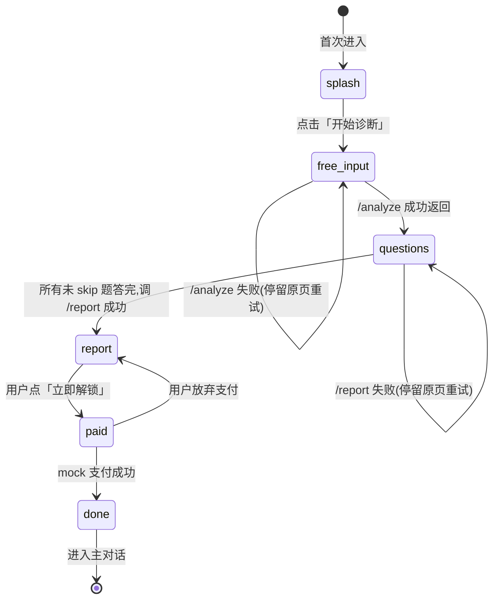

# Onboarding v2 · localStorage 协议

> **文档性质**:前端本地存储规范
> **Owner**:Agent A(契约定义者)
> **主要消费方**:Agent E(前端 Splash+自由描述+题库)、Agent F(前端 报告+付费)
> **冻结状态**:✅ 冻结

---

## 一、为什么用 localStorage 而不是 cookie / 后端 session

- 本期**无登录**、**无用户账号**,但 onboarding 流程跨多个页面且可能被用户刷新 → 必须本地持久化
- localStorage 足够可靠(现代浏览器 10MB 上限,onboarding 数据 <100KB)
- 前端刷新后能自动回到上次的进度(或自动跳到正确页面)
- 付费成功回跳时,前端能识别「我是付了钱的同一用户」继续走

---

## 二、Key 与整体结构

- **Storage Key**:`crushe_onboarding_v2`(唯一 key,所有 onboarding 状态都塞在这里,便于一次性清理)
- **Value 类型**:JSON 字符串(用 `JSON.parse`/`JSON.stringify` 读写)

```json
{
  "protocol_version": 1,
  "session_id": "7c2f3b0a-5e8d-4e1a-b9f3-12345abcde01",
  "stage": "questions",
  "free_text": "他是我同事……",
  "uploaded_images": [
    { "url": "https://.../chat-01.png", "ocr": "[他] 嗯嗯……" },
    { "url": "https://.../chat-02.png", "ocr": "[他] 哈哈……" }
  ],
  "analysis": {
    "skip_rules": { "A1": { "skip": true, "reason": "……", "preselect": null, "rewrite": null }, "…": "…" },
    "first_hook": "你提到表白完之后对方回复变慢了……"
  },
  "answers": {
    "A3": ["A"],
    "A4": ["A", "C"]
  },
  "report": null,
  "paid": false,
  "paid_at": null
}
```

---

## 三、字段详解

| 字段 | 类型 | 必填 | 说明 |
| :--- | :--- | :--- | :--- |
| `protocol_version` | int | 是 | 固定为 `1`。后续破坏式变更会 bump 这个版本号,前端检测到版本不一致时自动清空 |
| `session_id` | string(UUID v4) | 是 | 前端在进入 splash 页时调用 `crypto.randomUUID()` 生成;一经生成不改。后端接口全链路追踪靠它 |
| `stage` | enum | 是 | 当前处于哪个阶段(见下节枚举) |
| `free_text` | string | 否 | 用户在自由描述页输入的文本。stage 进入 `questions` 后开始有值 |
| `uploaded_images` | array | 否 | 上传的截图数组,每项 `{ status, url, ocr, ocr_failed, preview_url }`。见下方 `status` 枚举说明。OCR 为空字符串表示 OCR 失败 |
| `analysis` | object | 否 | `/analyze` 端点响应的完整副本(包括 `skip_rules` + `first_hook`)。用 null 表示还没调用 |
| `answers` | object | 否 | 用户答题结果,key=题号、value=单选字符串或多选数组。被 skip 的题**不出现在 answers 里** |
| `report` | object | 否 | `/report` 端点响应的完整副本(即 `DiagnosisReport`)。用 null 表示还没生成 |
| `paid` | bool | 是(默认 false) | 付费闸门是否通过。本期 mock 支付直接置 true |
| `paid_at` | ISO 时间戳 or null | 否 | 付费时间,用于审计 |

### 3.1 `uploaded_images[i].status` 枚举（并行流水线状态机）

| status | 含义 | 何时写入 | 下一步 |
| :--- | :--- | :--- | :--- |
| `uploading` | 正在调 `/api/upload/upload-only` 拿 URL（~2s） | 用户选文件触发 handleUpload | → `ocr-pending` 或 `failed` |
| `ocr-pending` | URL 已拿到，OCR 后台在跑（~60-90s） | upload-only 返回 success | → `ready`（成功或 OCR 异常都算 ready，失败时 `ocr_failed=true`） |
| `ready` | URL + OCR 全部完成（OCR 失败也归这里，用 `ocr_failed` 区分） | ocr-only 后台返回 | 终态 |
| `failed` | 上传失败（step1 挂） | upload-only 抛异常 | 终态，用户需要重传 |

**关键：** 只要 status ∈ `{ocr-pending, ready}`，用户就可以点"提交 · 开始诊断"——analyze 节点不消费 OCR，只需要 URL；OCR 结果留给最终 `/report` 用（由 `report.html` 从 localStorage 拉取）。

---

## 四、stage 枚举与对应页面

### 4.1 enum 值

| stage | 含义 | 下一步 |
| :--- | :--- | :--- |
| `splash` | 开屏页(品牌锚定 + "开始诊断"按钮) | → free_input |
| `free_input` | 自由描述页(文字 + 截图) | → questions(调完 /analyze 后) |
| `questions` | 题库循环(跑 A1-A5 中没 skip 的题 + 中间钩子 + 总结钩子) | → report(跑 /report 后) |
| `report` | 诊断报告页(看免费报告) | → paid(看完后付费) |
| `paid` | 付费闸门(mock 支付) | → done |
| `done` | Onboarding 完成。用户进入主对话;下次再打开,不再进 onboarding |

### 4.2 刷新后的跳转规则

前端初始化时读 localStorage,按下表决定打开哪个页面:

| 保存的 stage | 刷新后跳到 | 注意 |
| :--- | :--- | :--- |
| (无 key) | `/splash` | 全新用户 |
| `splash` | `/splash` | 用户还没点"开始诊断" |
| `free_input` | `/free_input`(恢复 free_text 草稿 + 已上传图片) | 防止用户白写一堆 |
| `questions` | `/questions`(找到第一个还没 answer 且没 skip 的题继续) | analysis 必须在本地 |
| `report` | `/report`(渲染本地 report) | 不需要重新请求 /report |
| `paid` | `/paid`(mock 支付页) | 显示"正在跳转支付" |
| `done` | `/chat`(主对话页) | 跳过整个 onboarding |

### 4.3 状态迁移图(Mermaid)



### 4.4 ASCII 版状态迁移图(供不支持 Mermaid 的环境查看)

```
          +--------+
  start-->| splash |
          +--------+
              |
              | 点击「开始诊断」
              v
         +------------+
         | free_input | <-----+
         +------------+       |
              |               | /analyze 失败重试
              | /analyze ok   |
              v               |
         +-----------+--------+
         | questions | <--+
         +-----------+    |
              |           | 还有没答的题
              | 全部答完   |
              | /report ok |
              v            |
         +--------+         |
         | report |         | /report 失败留在 questions
         +--------+
              |
              | 点「立即解锁」
              v
         +------+
         | paid |
         +------+
           |  |
     支付  |  | 放弃
     成功  |  +-----> 回 report
           v
        +------+
        | done |-----> 进入主对话
        +------+
```

---

## 五、写入时机(给 Agent E/F 实施参考)

| 事件 | 写入操作 |
| :--- | :--- |
| 进入 splash 页、发现 key 不存在 | 创建完整 JSON:生成 `session_id`,`stage = "splash"`,其他字段初始化为默认值 |
| 用户点「开始诊断」 | `stage = "free_input"` |
| 用户上传一张截图 | 往 `uploaded_images` push 一项;OCR 回来后回填 ocr |
| 用户在自由描述页输入文字 | 500ms 防抖后写入 `free_text`(不改 stage) |
| 用户点「提交」,调 `/analyze` 成功 | `analysis = 响应`, `stage = "questions"` |
| 用户答完一道题 | `answers[题号] = 答案`(不改 stage) |
| 最后一道题答完,调 `/report` 成功 | `report = 响应`, `stage = "report"` |
| 用户点「立即解锁」 | `stage = "paid"` |
| Mock 支付回调成功 | `paid = true`, `paid_at = ISO 当前时间`, `stage = "done"` |
| 用户在主对话里点「重新诊断」(如有此入口) | 完全删除这个 key |

---

## 六、清理与兼容性

- **协议版本 bump**:前端读 key 后若 `protocol_version != 1`,直接删除整个 key,按首次进入处理
- **手动重置**:开发调试时可在 DevTools 里执行 `localStorage.removeItem("crushe_onboarding_v2")`
- **不要分多个 key**:所有状态集中在一个 key,保证一致性(否则用户"只清一半"时前端状态会错乱)

---

## 七、变更记录

| 日期 | 作者 | 变更 |
| :--- | :--- | :--- |
| 2026-04-21 | Agent A | 初版冻结 |
