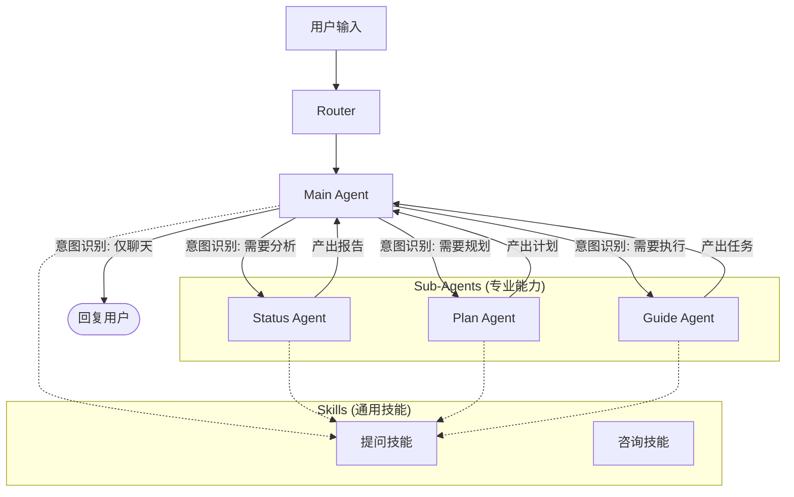

# 模型层架构与智能体协同 (Model Layer Architecture)

## 1. 核心设计理念 (Core Design Philosophy)

我们的模型层采用 **Orchestrator-Worker (中枢-执行者)** 的多agent架构。有一个主理人（Main Agent）负责接待和统筹，遇到特定专业问题时，调度给背后的分析师（Status）、战略家（Plan）或教练（Guide）进行处理。

### 1.1 核心原则
*   **拟人化分工**：每个 Agent 都有明确的“职业定位”，不仅仅是代码模块，而是扮演特定角色的智能体。
*   **对外统一 (Unified Persona)**：虽然内部有多个 Agent 协作，但**对外（用户视角）始终只有“小话”这一个统一的人设**。用户不会感知到“现在是分析师在说话”或“转接给教练”，所有的Agent输出都统一口径，保持人格的连贯性和温度。
*   **委婉诚实 (Tactful Honesty)**：这是所有 Agent 共享的底层人格。我们既不盲目共情（当情绪垃圾桶），也不生硬说教。我们用“亦师亦友”的口吻，指出用户不愿面对的现实，并提供解决方案。
*   **战略与战术分离**：我们将“怎么看”（Status）、“大方向怎么走”（Plan）和“具体怎么做”（Guide）拆分为三个独立的决策环节，确保思考的深度和执行的精度。

---

## 2. 智能体角色清单 (Agent Roster)

### 2.1 Main Agent - 决策中枢 (The CEO)
> **定位**：用户的专属恋爱军师、系统的调度中心。

*   **核心职责**：
    1.  **意图识别 (Triage)**：像急诊室分诊台一样，判断用户是需要安慰、咨询知识、分析现状还是制定计划。
    2.  **流量分发 (Routing)**：决定调用哪个子 Agent (`call_status`, `call_plan`, `call_guide`) 或直接回复 (`end_turn`)。
    3.  **统一对外窗口**：用户感知到的始终是“小话”这一个角色。Main Agent 负责将子 Agent 的产出（如报告、计划）用统一的口吻传递给用户，保持人设的一致性。
    4.  **兜底回复**：处理闲聊、情绪安抚 (`emotion_vent`) 和通用知识问答 (`consult_only`)。

*   **可用技能 (Available Skills)**：
    *   `Inquiry Skill` (提问)
    *   `Consult Skill` (咨询)
    *   `Emotion Support Skill` (情绪安抚)

*   **触发条件**：所有用户消息首先进入 Main Agent（经由 Router）。

### 2.2 Status Agent - 现状分析师 (The Diagnostician)
> **定位**：冷峻的诊断专家，负责看清局势。

*   **核心职责**：
    *   基于 **ACR 情感物理学** (Attraction, Comfort, Romance) 对关系进行评分。
    *   基于 **L/T 矩阵** (Logic/Trap) 判断用户是在“主线”还是“陷阱线”（如备胎、短择）。
    *   识别关系的“致命伤” (Fatal Flaw) 和“隐患点”。
*   **输出产物**：**情感罗盘报告 (Status Report)**。
*   **可用技能 (Available Skills)**：
    *   `Inquiry Skill` (提问)：当信息不足以进行诊断时调用。
*   **触发场景**：
    1.  **初次生成**：初次咨询、用户请求分析时。
    2.  **更新/修正**：当获取到新信息（如新的聊天记录）导致原有判断需要修正，或发现之前的诊断有过时风险时。

### 2.3 Plan Agent - 战略参谋 (The Strategist)
> **定位**：宏观布局的军师，负责制定路线图。

*   **核心职责**：
    *   基于 Status Agent 识别的“致命伤”，制定阶段性的推进目标。
    *   划分战役阶段（如：Phase 1 冷冻降压 -> Phase 2 试探复联）。
    *   设定每个阶段的“通关里程碑” (Milestone)。
*   **输出产物**：**行动规划书 (Action Plan)**。
*   **可用技能 (Available Skills)**：
    *   `Inquiry Skill` (提问)：当信息不足以制定战略时调用。
*   **触发场景**：
    1.  **初次生成**：现状已明确，但用户不知道大方向该怎么走时。
    2.  **更新/修正**：当现状发生变化（如 Status Report 更新），或者原有战略执行受阻需要调整方向时。

### 2.4 Guide Agent - 战术教练 (The Tactician)
> **定位**：手把手的执行教练，负责SOP落地。

*   **核心职责**：
    *   将宏观 Plan 拆解为原子化的、可执行的 **Action Guide (行动指南)**。
    *   生成具体的 **SOP 任务卡片**（如：具体发什么朋友圈、怎么回消息、约会流程）。
    *   管理任务状态（进行中、已完成、已取消）。
*   **输出产物**：**任务卡片 (Task Card)**。
*   **可用技能 (Available Skills)**：
    *   `Inquiry Skill` (提问)：当信息不足以生成具体指令时调用。
*   **触发场景**：
    1.  **初次生成**：战略已定，用户需要具体执行步骤时。
    2.  **更新/修正**：当用户反馈了执行结果（成功/失败），需要生成新的后续任务，或调整当前任务的细节时。

---

## 3. 协同工作流 (Collaboration Workflow)

整个系统通过 **LangGraph** 进行编排，形成一个有状态的循环工作流。

### 3.1 典型流转路径
1.  **全流程咨询**：Main (接待) -> Status (分析) -> Plan (定策) -> Guide (执行) -> Main (总结陈词)。
2.  **单点突破**：Main -> Guide (直接生成行动建议) -> Main。
3.  **信息补全**：任何 Agent 发现信息不足 -> 调用 `Inquiry Skill` (生成提问卡) -> 结束本轮 (`end_turn`) -> 用户回答 -> 下一轮带上回答恢复执行。

---

## 4. 核心技能与工具 (Core Skills)

Agent 并不把所有逻辑写死在 Prompt 里，而是通过**动态加载工具 (Dynamic Tool Loading)** 来获取特定能力。

### 4.1 提问技能 (Inquiry Skill)
*   **作用**：当 Agent 发现无法通过现有信息做出决策时，调用此技能。
*   **机制**：生成 **Inquiry Card**（提问卡片），包含问题列表、提问意图和引导语。

### 4.2 咨询技能 (Consult Skill)
*   **作用**：回答用户关于恋爱心理学、具体概念（如“什么是推拉”）的知识性问题。
*   **机制**：Main Agent 直接调用，不经过子 Agent。

---

## 5. 上下文依赖 (Context Dependencies)

模型层的决策高度依赖于存储层的数据（参考 `information_storage.md`）。每个 Agent 在启动时，都会自动加载以下上下文：

1.  **User Context (用户画像)**：我是谁，她是真的吗，我们的基本情况。
2.  **Status Report (现状)**：如果你是 Plan/Guide Agent，必须基于最新的 Status Report 工作，确保“对症下药”。
3.  **Action Plan (规划)**：如果你是 Guide Agent，必须在 Plan 的框架下生成任务，确保“战术服从战略”。
4.  **Conversation History (对话流)**：包含 `<user>`, `<assistant>`, `<thought>` 的完整记录，确保对话连贯性。

这种**链式依赖**（Status -> Plan -> Guide）保证了系统输出的逻辑闭环。

