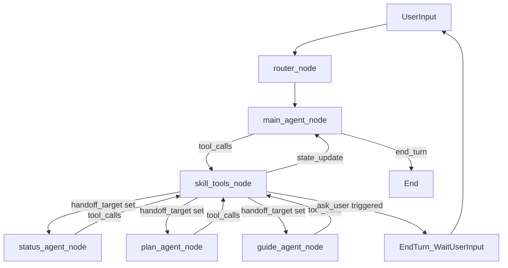

## Tools 文档（面向新人）

这套文档解释 **Crushe Agent 系统里的“Tools（工具）”是什么、有哪些、怎么用、以及它们如何驱动工作流与状态机**。读者默认第一次接触本项目，因此所有描述以“现状/当前系统”为准，不依赖任何历史版本知识。

---

## 你会在这里学到什么

- **Tool 在系统里的角色**：模型如何通过 tool_call 触发“执行动作”，以及工具执行后如何写回 `AgentState`
- **工具分类与心智模型**：任务系统、上下文绑定、专家 handoff、两阶段状态机工具、skills 渐进式披露
- **两阶段（有状态）渐进式披露**：为什么会出现 “先 enable 再执行/关闭” 的工具调用节奏

---

## 快速索引（按问题找入口）

- **我想知道系统有哪些 tool**：见 [`tool_catalog.md`](tool_catalog.md)
- **我不理解“先 enable 再继续”的两阶段机制**：见 [`architecture_and_lifecycle.md`](architecture_and_lifecycle.md)
- **我需要在多轮对话里保持同一话题的连续性（任务）**：见 [`task_system_tooling.md`](task_system_tooling.md)
- **我想把某段上下文跨轮次持续注入（绑定）**：见 [`context_loader.md`](context_loader.md)
- **我想把问题交给 Status/Plan/Guide 专家处理（handoff）**：见 [`handoff_delegate_tools.md`](handoff_delegate_tools.md)
- **我看到 `DrawerTools`/历史抽屉相关代码但不知道用途**：见 [`drawer_tools.md`](drawer_tools.md)
- **我想理解 skills 的渐进式披露（load_skill）**：见 [`skills_and_load_skill.md`](skills_and_load_skill.md)

---

## 总览：系统里的 tool 是怎么跑起来的

系统的核心思想是：**LLM 不直接“修改状态”，而是通过 tool_call 产出结构化意图；工作流负责执行工具并把结果映射为状态变化**。

关键实现集中在：

- `agent_impl/graph/workflow.py`：`skill_tools_node` 统一执行工具 + 处理两阶段状态机
- `agent_impl/graph/nodes/main_agent.py`：主 Agent 挂载工具、在第二阶段时“强制 tool_call”（确保闭环）
- `agent_impl/graph/message_builder.py`：ToolMessage 的“用完即焚/动态简化”，避免历史上下文膨胀
- `agent_impl/graph/state.py`：`AgentState` 的 tool 相关字段定义（mode、handoff、pending_action 等）

---

## 一张图：从用户输入到 tool_call 到状态更新（含两阶段）

### 这张图里最容易困惑的点

- **工具不是直接返回“最终回复”**：很多工具返回的是“动作 JSON”（例如 `{"action":"handoff"}` / `{"action":"ask_user"}`），工作流会把它转成 `AgentState` 更新和后续节点路由。
- **两阶段工具（有状态）**：例如 `ask` 的 Phase1 只负责进入模式（设置 `ask_mode=True`），Phase2 才负责生成 `inquiry_card` 并结束模式（复位 `ask_mode=False`）。这类机制详见 [`architecture_and_lifecycle.md`](architecture_and_lifecycle.md)。

---

## 文档边界（我们覆盖哪些工具）

本目录覆盖两类“工具”：

- **Graph/Workflow 工具**：集中在 `agent_impl/graph/tools/`，例如 `task_manager`、`context_loader`、`delegate_to_*`、`ask/consult_answer/emotion_support` 等。
- **Skills 渐进式披露工具**：集中在 `agent_impl/skills/`，核心是 `load_skill(skill_id)`；此外，本系统还实现了**状态驱动的两阶段工具**来承载“渐进式披露”的策略注入（`ask/consult_answer/emotion_support`）。

如果你只想快速上手：先读 `tool_catalog.md` + `architecture_and_lifecycle.md`。

